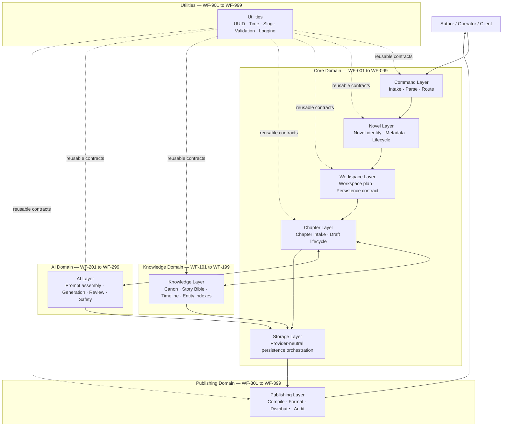
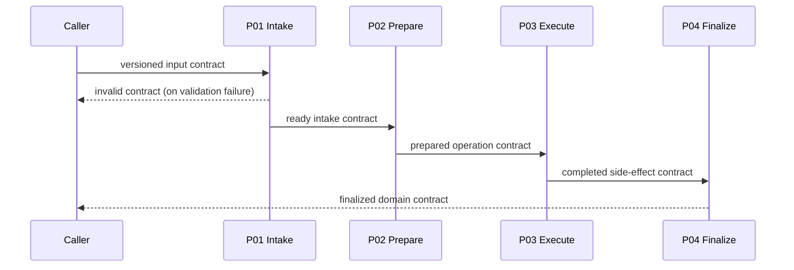

# Novel Studio Architecture Bible

**Version:** 1.0  
**Status:** Official  
**Effective date:** 2026-07-31  
**Scope:** All Novel Studio workflows, contracts, documentation, tests, and supporting assets

> This document is the highest-level architecture authority for Novel Studio.
> Every future workflow and every material revision to an existing workflow must
> comply with it. When lower-level documentation conflicts with this Bible, this
> document takes precedence unless an approved architecture decision explicitly
> amends it.

## Table of Contents

1. [Vision, Mission, and Core Philosophy](#1-vision-mission-and-core-philosophy)
2. [System Architecture](#2-system-architecture)
3. [Workflow Numbering Rules](#3-workflow-numbering-rules)
4. [Workflow Design Rules](#4-workflow-design-rules)
5. [Part Rules](#5-part-rules)
6. [Contract Standard](#6-contract-standard)
7. [Node Naming Standard](#7-node-naming-standard)
8. [Repository Folder Structure](#8-repository-folder-structure)
9. [README Standard](#9-readme-standard)
10. [Testing Standard](#10-testing-standard)
11. [GitHub Workflow](#11-github-workflow)
12. [Codex Development Rules](#12-codex-development-rules)
13. [Future Roadmap](#13-future-roadmap)
14. [Engineering Principles](#14-engineering-principles)
15. [Glossary](#15-glossary)

---

## 1. Vision, Mission, and Core Philosophy

### Vision

Novel Studio is a modular operating system for developing, maintaining, and
publishing long-form fiction. It gives authors and automated agents a shared,
traceable model of a novel without tying the creative process to one interface,
AI provider, or storage platform.

### Mission

Novel Studio transforms creative intent into explicit, versioned contracts that
small workflows can validate and process. The system must preserve authorial
control, story continuity, operational transparency, and portability from first
command through publication.

### Core Philosophy

1. **Contract first.** Define and test the boundary before implementing behavior.
2. **Small, composable workflows.** Each workflow performs one job and delegates
   unrelated work through a documented contract.
3. **Deterministic before generative.** Validation, normalization, routing, and
   persistence preparation precede AI execution.
4. **Author authority.** AI proposes; the author or an explicit policy approves.
5. **Traceable state.** Important artifacts carry identity, version, timestamps,
   provenance, and validation status.
6. **Provider independence.** Core domain contracts must not expose the details
   of a storage, messaging, model, or publishing vendor.
7. **Safe failure.** Expected invalid input returns a structured invalid contract;
   exceptional infrastructure failures are explicit and observable.
8. **Evolution without surprise.** Versioned workflows and schemas protect
   existing callers while capabilities grow.

---

## 2. System Architecture

Novel Studio is a contract-driven workflow graph organized into layers. A layer
owns a coherent class of decisions and communicates with other layers only
through declared workflow contracts.

### Complete logical architecture



### Runtime contract flow

```text
External event
  │
  ▼
Command Layer ──validated intent──▶ Novel / Workspace / Chapter Layer
  │                                      │
  │ invalid contract                     ├──▶ Knowledge Layer
  ▼                                      ├──▶ AI Layer
Caller / operator                        └──▶ Storage Layer
                                                 │
                                                 ▼
                                         Publishing Layer

Utilities are invoked as leaf sub-workflows; they never control domain routing.
```

### Layer responsibilities

| Layer | Owns | Must not own |
| --- | --- | --- |
| **Command** | Channel-neutral intake, command parsing, intent validation, routing | Novel state, content generation, persistence |
| **Novel** | Novel identity, metadata normalization, lifecycle contracts | Physical workspace operations, chapter prose |
| **Workspace** | Workspace structure, manifests, provider-neutral persistence plans | Provider credentials or physical writes unless delegated to Storage |
| **Chapter** | Chapter requests, chapter identity, lifecycle, draft orchestration | Global canon authority or provider-specific AI calls |
| **Storage** | Persistence adapters, idempotency, write/read results, storage errors | Creative decisions, canonical interpretation |
| **Knowledge** | Canon, Story Bible, timeline, character/world indexes, retrieval context | Unreviewed prose generation or publishing |
| **AI** | Prompt construction, provider adapter invocation, generation, evaluation | Canon approval, permanent storage, secret distribution |
| **Publishing** | Compilation, format validation, release packaging, distribution audit | Draft generation or canon mutation |
| **Utilities** | Reusable pure helpers and cross-cutting technical contracts | Domain orchestration or business policy |

### Dependency direction

Dependencies flow from orchestration toward capabilities and from domain layers
toward Utilities. Lower-level workflows do not call their callers. Cycles are
prohibited unless an architecture decision documents the bounded loop, exit
condition, ownership, and test strategy. Storage and AI vendors are accessed
through adapter workflows so their response shapes never become core contracts.

---

## 3. Workflow Numbering Rules

A workflow ID is permanent after merge. Retired IDs are never reassigned.

| Range | Domain | Examples |
| --- | --- | --- |
| `WF-001`–`WF-099` | Core | Commands, novels, workspaces, chapters, storage orchestration |
| `WF-101`–`WF-199` | Knowledge | Canon, Story Bible, timeline, entity knowledge |
| `WF-201`–`WF-299` | AI | Prompting, generation, evaluation, model adapters |
| `WF-301`–`WF-399` | Publishing | Compilation, formatting, release, distribution |
| `WF-901`–`WF-999` | Utilities | UUID, dates, slugs, common validation, logging |

Rules:

1. Use three digits with leading zeros: `WF-004`, never `WF-4`.
2. Assign the next available ID in the correct domain; do not encode priority,
   sprint, team, or vendor in the number.
3. One workflow number represents one enduring capability. Its Parts implement
   a staged pipeline for that capability.
4. Experimental work uses a branch or draft status, not an unofficial number.
5. Reserve a number in the roadmap before implementation to prevent collision.
6. Movement between ranges requires a new workflow ID and a migration plan;
   renaming an existing ID is not permitted.
7. Utility workflows must be domain-neutral. A helper containing novel-specific
   policy belongs in the Core range, not `WF-901`–`WF-999`.

Canonical display name:

```text
WF-<three digits> P<two digits> - <Action-Oriented Name>
```

Canonical file name:

```text
WF-<three digits>_P<two digits>_v<major>.<minor>.json
```

---

## 4. Workflow Design Rules

### Single Responsibility

A workflow has one reason to change and one observable outcome. Parsing a
command, constructing chapter intake, generating prose, and saving a file are
separate responsibilities. If its purpose statement requires “and” between
unrelated outcomes, split it.

### Composable

Every callable workflow has an Execute Workflow Trigger, a documented input
contract, and one terminal output contract per outcome class. Callers depend on
the contract, not internal nodes.

### Reusable

Shared deterministic logic belongs in a utility or reusable domain workflow once
it has at least two consumers or carries material consistency risk. Reuse must
reduce duplication without creating a generic workflow that hides domain policy.

### Versioned

Workflow exports, contracts, README version history, and releases are versioned.
Backward-compatible additions increment the minor version. Breaking field,
meaning, validation, or routing changes increment the major version and require
a migration path.

### Independent

A workflow must be importable and testable with mock input without relying on a
particular editor session or undeclared workflow state. All dependencies,
credentials, environment settings, and expected routes are documented.

### Maximum recommended node count

- **Recommended maximum:** 12 nodes per Part.
- **Review threshold:** 13–15 nodes requires written justification in the README.
- **Hard design review:** More than 15 nodes requires splitting the Part or an
  approved architecture decision record.

The count includes triggers and terminal nodes. Visual convenience does not
justify excess nodes; clarity, failure isolation, and testability do.

### Naming rules

- Names use English, Title Case, and an action plus domain object.
- Workflow names follow `WF-NNN PNN - Name`.
- Routes use lowercase dot notation: `chapter.create.intake`.
- Targets use `WF-NNN-PNN` and never a mutable n8n internal ID.
- JSON keys use `snake_case`; booleans begin with `is_`, `has_`, or `can_`.
- Timestamps end in `_at` and use UTC ISO 8601.
- UUID fields end in `_uuid`; do not call a UUID an `id`.
- Avoid vendor names in domain workflows and contracts.
- Avoid ambiguous verbs such as `Process`, `Handle`, or `Do`.

---

## 5. Part Rules

Parts divide one capability into stable, testable stages. Parts are not arbitrary
file-size partitions.

| Part | Default responsibility | Typical output |
| --- | --- | --- |
| **P01 — Intake** | Validate route, extract and normalize caller input, create an intake contract | `*.intake`, target P02 |
| **P02 — Build/Prepare** | Build canonical metadata or a provider-neutral operation contract | `*.prepared` or `*.built`, target P03 |
| **P03 — Execute/Persist** | Perform the bounded side effect through an adapter and capture its result | `*.completed` or `*.persisted`, target P04 or caller |
| **P04 — Finalize/Route** | Verify outcome, update indexes/audit data, and route to the next capability | `*.finalized` or next workflow target |

A capability may stop before P04 when later responsibilities do not exist. It
must not create empty Parts merely to fill the sequence. Additional Parts require
an architecture review and retain sequential numbering.

### Responsibilities

1. P01 performs no infrastructure side effects.
2. P02 remains provider-neutral unless the workflow capability is explicitly an
   adapter.
3. P03 owns idempotency, retry boundaries, and side-effect error translation.
4. P04 owns completion semantics, not the side effect itself.
5. Each Part validates the incoming route, status, required context, and schema
   version before acting.

### Connection rules



- Connect Parts only through their documented output and input contracts.
- A Part may short-circuit with `status: "invalid"` without calling its target.
- Do not read another node by display name across a workflow boundary.
- Do not skip a Part to reuse its internal assumptions.
- Preserve correlation and domain UUIDs through every Part.

### Execute Workflow policy

1. Cross-workflow calls use the n8n Execute Workflow mechanism.
2. Callable workflows begin with **Workflow Trigger** set to **Accept all data**.
3. The caller uses the contract `target`; it must not infer a target from status.
4. Production callers wait for completion when the returned contract affects the
   next decision. Fire-and-forget requires explicit audit and recovery design.
5. Sub-workflow errors are converted at the owning boundary into an observable
   error contract; expected validation failures must not throw.
6. Never hardcode an n8n workflow database ID in committed JSON. Resolve targets
   by deployment configuration or stable workflow identity.
7. A workflow may call Utilities, its next Part, or an approved lower-level
   capability. Reverse calls and undocumented recursion are forbidden.

---

## 6. Contract Standard

All cross-workflow contracts use JSON-compatible values and the following
canonical envelope. Fields may be omitted only where this section explicitly
allows it.

| Field | Type | Rule |
| --- | --- | --- |
| `schema_version` | string | Required; semantic contract version such as `1.0` |
| `route` | string | Required; lowercase dot notation describing the event or intent |
| `target` | string | Required when `status` permits continuation; `WF-NNN-PNN` |
| `status` | string | Required; controlled state such as `ready`, `invalid`, `completed`, `failed` |
| `is_valid` | boolean | Required at validation boundaries |
| `validation_errors` | array of strings | Required at validation boundaries; empty when valid |
| `context` | object | Required for valid domain handoffs; identifiers and operation data |
| `metadata` | object | Optional extension data, provenance, versions, and non-routing annotations |
| `created_at` | string | Required for newly created contracts; UTC ISO 8601 |
| `updated_at` | string | Required for mutable/reissued contracts; UTC ISO 8601 |

### Invariants

- `is_valid: true` implies `validation_errors: []`.
- `status: "invalid"` implies `is_valid: false` and at least one error.
- An invalid contract must not advertise an executable `target`.
- `context` contains business data; `metadata` contains information about the
  contract or its processing.
- Unknown fields are ignored only within a documented extension policy.
- Secrets, credentials, provider tokens, and binary content are prohibited.
- Contract timestamps describe contract events, not source artifact timestamps.
- Changes in field meaning are breaking even when the JSON type is unchanged.

### Valid example

```json
{
  "schema_version": "1.0",
  "route": "chapter.create.intake",
  "target": "WF-004-P02",
  "status": "ready",
  "is_valid": true,
  "validation_errors": [],
  "context": {
    "workspace_uuid": "33f74ca8-b512-48ae-b0ac-f71e9c924859",
    "novel_uuid": "6fc48e62-f59d-4c46-93a2-1807c3cd07c2",
    "chapter_number": 1,
    "chapter_title": "Opening"
  },
  "metadata": {
    "source_workflow": "WF-004-P01",
    "correlation_uuid": "f1e575a5-b1a8-4fd1-85e1-2cae15bb2811"
  },
  "created_at": "2026-07-31T00:00:00.000Z",
  "updated_at": "2026-07-31T00:00:00.000Z"
}
```

### Invalid example

```json
{
  "schema_version": "1.0",
  "route": "chapter.create.intake",
  "status": "invalid",
  "is_valid": false,
  "validation_errors": [
    "workspace_uuid is required.",
    "chapter_number must be a positive integer."
  ],
  "metadata": {
    "source_workflow": "WF-004-P01"
  },
  "created_at": "2026-07-31T00:00:00.000Z",
  "updated_at": "2026-07-31T00:00:00.000Z"
}
```

### Status vocabulary

| Status | Meaning |
| --- | --- |
| `ready` | Valid and eligible for its target |
| `invalid` | Expected contract/input validation failure; no target execution |
| `prepared` | Provider-neutral operation is assembled but not executed |
| `completed` | Requested operation completed successfully |
| `failed` | Execution or infrastructure failure requiring handling |
| `skipped` | Policy deliberately suppressed an otherwise valid operation |

Domain-specific statuses require documentation and architecture review.

---

## 7. Node Naming Standard

Node names communicate intent in execution logs. Use one unique, Title Case name
per workflow.

| Prefix/name | Use | Example |
| --- | --- | --- |
| `Workflow Trigger` | Execute Workflow Trigger entry point | `Workflow Trigger` |
| `Validate` | Check constraints without mutating domain meaning | `Validate Chapter Input` |
| `Extract` | Select values from an input envelope | `Extract Chapter Input` |
| `Normalize` | Canonicalize types, whitespace, casing, or aliases | `Normalize Metadata` |
| `Generate` | Produce a new value or collection | `Generate File Manifest` |
| `Build` | Assemble a multi-field domain contract or payload | `Build Chapter Contract` |
| `Output` | Emit the terminal contract | `Output` or `Output Invalid Contract` |

### Code Node naming

Code nodes use `<Verb> <Specific Object>`, such as `Validate Workspace Contract`
or `Generate Persistence Manifest`. A Code node must not be named `Code`,
`JavaScript`, `Function`, or `Process Data`. Complex unrelated transformations
must be separated, and code must not access npm or undeclared globals.

### Set Node naming

Set/Edit Fields nodes use `Set <Specific Object or Fields>`, such as `Set Output
Envelope`. Use them for declarative assignment, never to conceal business logic
inside long expressions. When a project requirement mandates all-JavaScript
transformation, use a clearly named Code node instead.

### Switch naming

Switch nodes use `Route by <Discriminator>`, such as `Route by Command` or `Route
by Status`. Outputs carry human-readable labels matching documented route values.
A Switch must have an explicit fallback path; unmatched data must not disappear.

---

## 8. Repository Folder Structure

```text
Novel-Studio/
├── docs/                         # Architecture, decisions, and standards
│   └── Novel-Studio-Architecture-Bible-v1.0.md
├── workflows/                    # Importable n8n workflow exports
│   └── WF-NNN/
│       └── PNN/
│           ├── README.md
│           └── WF-NNN_PNN_vX.Y.json
├── templates/                    # Provider-neutral document/prompt templates
├── assets/                       # Static non-secret diagrams and media
├── tests/                        # Contract fixtures and automated checks
└── examples/                     # Sanitized end-to-end sample contracts
```

Rules:

- Workflow directories contain only that Part's export and README unless a test
  convention explicitly places fixtures beside it.
- Documentation shared by multiple workflows belongs in `docs/`.
- Templates are versioned text assets, never embedded credentials.
- Assets use descriptive, stable file names and document their source/license.
- Tests mirror workflow paths where practical: `tests/WF-004/P01/`.
- Examples use fictional data and must not contain production identifiers.
- Generated n8n runtime data, local environment files, and secrets are never
  committed.

---

## 9. README Standard

Every workflow Part includes a `README.md` beside its JSON export. It is an
operational contract, not a marketing summary.

### Mandatory sections

1. **Purpose** — one responsibility, intended caller, and explicit non-goals.
2. **Architecture** — node roles, dependencies, side effects, and design choices.
3. **Input** — complete JSON example, field table, required/optional rules, and
   accepted schema versions.
4. **Output** — valid, invalid, and failure examples with route/status semantics.
5. **Testing** — import, happy path, boundary, invalid, and contract checks.
6. **Compatibility** — minimum n8n version, node versions, credentials, and
   runtime assumptions.
7. **Version History** — version, date, and material changes.

Recommended additions are a workflow diagram, import guide, security notes,
idempotency behavior, limitations, and downstream targets. Examples must be
valid JSON and agree with the exported workflow.

---

## 10. Testing Standard

A workflow is not complete until each required test class passes or an explicit
environment limitation is recorded.

| Test | Required evidence |
| --- | --- |
| **Import Test** | JSON parses and imports into the supported n8n version without missing nodes |
| **Execute Test** | Happy-path mock input reaches the expected terminal node without error |
| **Contract Test** | Output keys, types, invariants, route, target, status, and schema version match documentation |
| **Mock Data Test** | Sanitized representative data covers aliases, optional fields, and boundaries |
| **Invalid Data Test** | Missing, malformed, wrong-route, and wrong-status input returns the documented invalid contract |

### Minimum test matrix

```text
1. Valid canonical input
2. Valid input with every optional field omitted
3. Minimum and maximum boundary values
4. Empty strings, nulls, wrong types, and malformed arrays/objects
5. Wrong route and status
6. Duplicate/replayed input for side-effect workflows
7. Downstream unavailable for workflows with integrations
```

Additional requirements:

- Parse every workflow JSON with a standard JSON parser.
- Execute or syntax-check every Code node.
- Assert expected node names and connections.
- Run `git diff --check` and inspect `git status`.
- Side-effect workflows test idempotency and use mocks/sandboxes by default.
- Never use real secrets or author manuscripts in committed fixtures.
- A README test claim must identify the exact command or manual procedure.

---

## 11. GitHub Workflow

### Branch Strategy

- Start from the latest protected `main`.
- Use one short-lived branch per bounded task.
- Recommended names: `feature/wf-004-p01-chapter-intake`,
  `docs/architecture-bible-v1`, or `fix/wf-002-contract-validation`.
- Do not mix workflow revisions, documentation policy, and unrelated cleanup.

### Pull Request

A pull request contains:

- an imperative title naming the capability;
- motivation and scope;
- files and contracts changed;
- compatibility or migration impact;
- exact tests and results;
- screenshots only when a visible runnable UI changed; and
- linked issue or architecture decision when applicable.

Reviewers verify contract compatibility, scope, secret safety, README accuracy,
node count, test evidence, and conformance with this Bible.

### Merge

- Required checks and reviews must pass.
- Resolve all review conversations before merge.
- Prefer squash merge for a single coherent change; preserve multiple commits
  only when they carry independently useful history.
- Delete the feature branch after merge.
- Direct commits to protected `main` are prohibited.

### Release

A release groups compatible, tested changes and publishes release notes covering
new routes, contract versions, migrations, supported n8n version, and known
limitations. Breaking changes require a major release and coexistence or a
migration window.

### Version Tag

Repository releases use semantic tags such as `v1.0.0`. Workflow artifacts keep
their own `vX.Y` file version. Documentation releases may use annotated tags such
as `architecture-v1.0.0`; tags are immutable and never reused.

---

## 12. Codex Development Rules

Codex and other coding agents follow the same review standard as human
contributors and may not expand scope to “improve” unrelated workflows.

### Prompt format

A development prompt should state:

```text
Project and objective
Allowed paths and explicit forbidden paths
Workflow name, source, and target
Required nodes in order
Input, valid output, and invalid output contracts
Technical restrictions and supported n8n version
Documentation requirements
Validation commands
Commit and pull-request requirements
Stop condition
```

Ambiguous contract semantics must be clarified before implementation or recorded
as an explicit, conservative assumption in the pull request.

### Deliverables

- Create exactly the requested workflow exports, READMEs, tests, or docs.
- Preserve all files outside allowed paths.
- Do not silently revise upstream contracts.
- Do not add generated caches, credentials, lockfiles, or dependencies unless
  explicitly required.

### Validation

Before commit, Codex must inspect repository instructions, parse JSON, syntax- or
execution-test Code nodes, verify n8n export structure, test valid and invalid
contracts, run `git diff --check`, and review `git status` for scope violations.
Environment limitations must be reported rather than disguised as success.

### Commit message

Use an imperative, scoped message no longer than 72 characters when practical:

```text
Add WF-004 chapter intake workflow
Document Novel Studio architecture standard
Fix WF-002 metadata validation
```

### PR rules

- Create the PR only after a successful commit.
- Title and body must describe the actual diff, not intended future work.
- Include a Summary and Testing section.
- Identify breaking contracts and migrations prominently.
- Never claim an import, execution, push, or test succeeded unless it ran.
- One PR should represent one bounded architectural change.

---

## 13. Future Roadmap

The roadmap reserves capability areas; it is not permission to implement an
unapproved workflow. Exact IDs become binding when accepted in a scoped design.

### Core platform — WF-001 to WF-099

| Phase | Workflow area | Direction |
| --- | --- | --- |
| Foundation | **WF-001** Command intake and routing | Stable multi-channel, channel-neutral commands |
| Foundation | **WF-002** Novel intake and metadata | Versioned novel identity and lifecycle |
| Foundation | **WF-003** Workspace provisioning | Provider-neutral plans and persistence contracts |
| Foundation | **WF-004** Chapter intake and lifecycle | Chapter contracts, drafting stages, completion |
| Near term | `WF-005`–`WF-019` | Storage adapters, artifact lifecycle, indexing, audit |
| Mid term | `WF-020`–`WF-049` | Outline, scene, revision, feedback, continuity orchestration |
| Long term | `WF-050`–`WF-099` | Collaboration, permissions, migration, operational governance |

### Knowledge Engine — WF-101 to WF-199

The Knowledge Engine will build and query canonical Story Bible data without
coupling retrieval to a single vector or database provider. Planned capability
families include canon ingestion and approval, character and world indexes,
timeline consistency, relationship graphs, provenance, retrieval context, and
conflict detection. Human-approved canon remains authoritative.

### AI Engine — WF-201 to WF-299

The AI Engine will separate prompt assembly, context selection, provider
adapters, generation, evaluation, safety, cost control, and author approval.
Model output is a proposal until a domain workflow accepts it. Provider-specific
schemas terminate at adapter boundaries.

### Publishing — WF-301 to WF-399

Publishing progresses from manuscript compilation through format validation,
front/back matter, EPUB/PDF/web packaging, release approval, distribution
adapters, and publication audit. **WF-399** marks the upper boundary of the
Publishing range, not a promised monolithic workflow.

### Utilities — WF-901 to WF-999

Utilities will centralize stable helpers such as UUID fallback, UTC timestamps,
slug normalization, schema validation, redaction, correlation, and structured
logging. Utilities return contracts and do not decide domain routes.

### Delivery sequence

```mermaid
roadmap
  title Novel Studio Capability Evolution
  Foundation : WF-001 Commands
             : WF-002 Novels
             : WF-003 Workspaces
             : WF-004 Chapters
  Knowledge Engine : WF-101 Canon
                   : Story Bible and Timeline
                   : Retrieval and Consistency
  AI Engine : WF-201 Prompt Assembly
            : Provider Adapters
            : Generation and Evaluation
  Publishing : WF-301 Compilation
             : Formats and Release
             : Distribution through WF-399
```

---

## 14. Engineering Principles

1. **Do not duplicate logic.** Centralize stable, repeated behavior at the
   narrowest appropriate reusable boundary.
2. **Prefer reusable workflows.** Reuse explicit contracts, not copied node code
   or invisible shared state.
3. **No hidden dependencies.** Declare callers, targets, environment variables,
   adapters, and runtime assumptions in the README.
4. **No external credentials inside workflow JSON.** Bind n8n credential
   references during deployment; never commit secrets or credential values.
5. **No hardcoded IDs.** Do not commit n8n database IDs, storage folder IDs,
   spreadsheet IDs, model deployment IDs, or environment-specific resource IDs.
6. **Contract first.** Review the input, valid output, invalid output, version,
   route, and target before building nodes.
7. **Validate at trust boundaries.** Treat every cross-workflow input as
   untrusted, even when the caller is internal.
8. **Make side effects idempotent.** A safe retry must not create duplicates or
   corrupt state.
9. **Keep domain and provider models separate.** Translate in adapters.
10. **Fail observably.** Return structured validation failures and expose
    exceptional execution failures with correlation context.
11. **Minimize data.** Pass only what the target needs and never include secrets.
12. **Preserve provenance.** Carry domain UUIDs, contract versions, correlation,
    source workflow, and timestamps.
13. **Document limitations honestly.** Deferred behavior is explicit, never
    implied by optimistic naming.
14. **Optimize for maintainers.** Clear contracts and node names outrank clever
    code or premature abstraction.

---

## 15. Glossary

| Term | Definition |
| --- | --- |
| **Novel** | The top-level creative work, identified by `novel_uuid`, with metadata and a lifecycle independent of its storage location. |
| **Workspace** | The logical container and manifest for all artifacts belonging to a Novel; it may later map to one or more physical providers. |
| **Metadata** | Descriptive or operational attributes about a domain object or contract, distinct from its primary content. |
| **Contract** | A versioned JSON boundary defining fields, types, invariants, routing, status, validation behavior, and ownership between workflows. |
| **Persistence** | The controlled act or provider-neutral plan of storing and retrieving state with identity, idempotency, and audit results. |
| **Canon** | Author-approved facts that are authoritative for continuity; generated suggestions are not Canon until accepted. |
| **Story Bible** | The curated body of canonical knowledge about premise, characters, world, rules, themes, terminology, and continuity. |
| **Timeline** | An ordered model of story and backstory events, including temporal relationships, dates where known, and continuity constraints. |
| **Character** | A story entity with stable identity, attributes, relationships, arc, appearances, and canon-backed state over time. |
| **World** | The settings, locations, cultures, systems, history, rules, and terminology within which the Novel occurs. |

---

## Document Governance

Changes to this Bible require an architecture-focused pull request, rationale,
compatibility analysis, and approval by the project architecture owner. A change
to normative rules increments the document version. Editorial corrections that
do not change meaning may be released as a patch revision.
