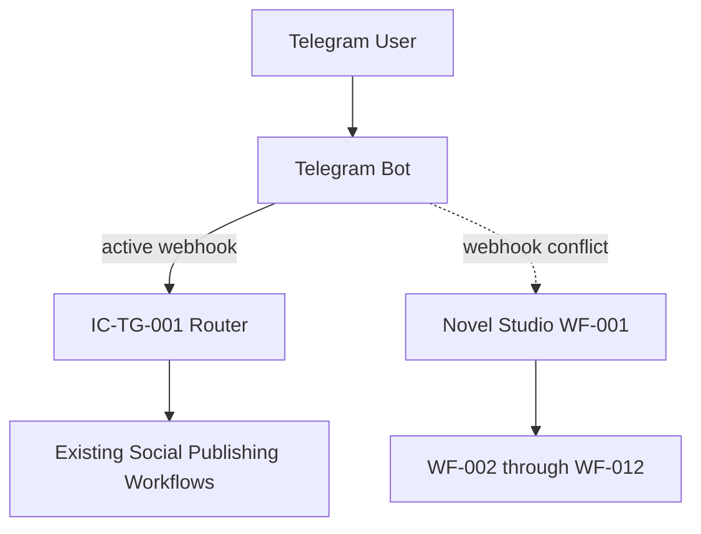
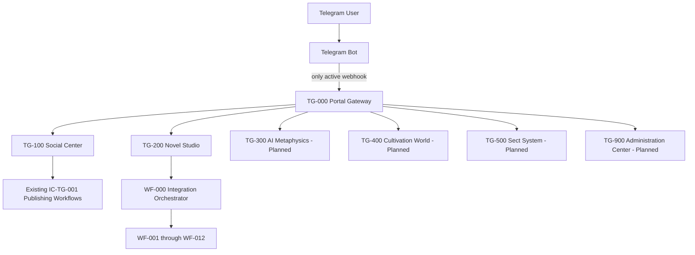
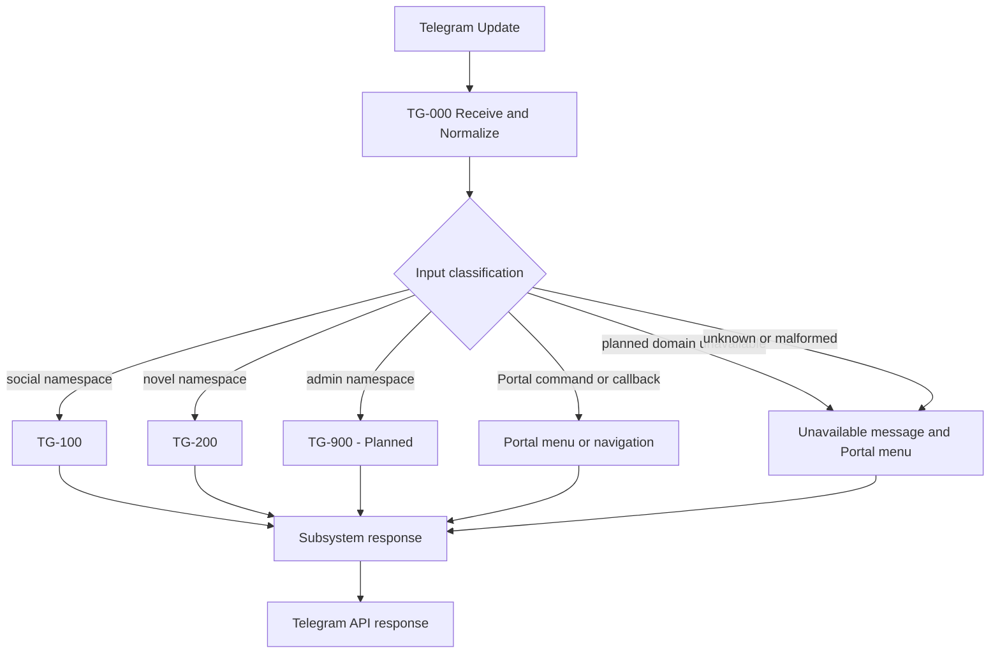
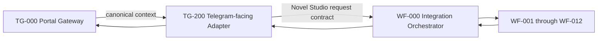
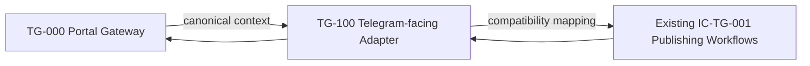

# 御策羅盤 Portal Architecture v1.0

## 目錄

1. [文件資訊](#1-文件資訊)
2. [願景與目標](#2-願景與目標)
3. [現況問題](#3-現況問題)
4. [Architecture Principles](#4-architecture-principles)
5. [System Context Diagram](#5-system-context-diagram)
6. [TG-000 Portal Gateway](#6-tg-000-portal-gateway)
7. [Portal Main Menu](#7-portal-main-menu)
8. [TG-100 Social Center](#8-tg-100-social-center)
9. [TG-200 Novel Studio](#9-tg-200-novel-studio)
10. [Future Subsystems](#10-future-subsystems)
11. [Command Routing Standard](#11-command-routing-standard)
12. [Callback Routing Standard](#12-callback-routing-standard)
13. [Shared Telegram Context Contract](#13-shared-telegram-context-contract)
14. [Routing Decision Table](#14-routing-decision-table)
15. [Error Handling](#15-error-handling)
16. [Security](#16-security)
17. [Identity and Session Model](#17-identity-and-session-model)
18. [Workflow Naming Standard](#18-workflow-naming-standard)
19. [Repository Structure](#19-repository-structure)
20. [Migration Plan](#20-migration-plan)
21. [Rollback Plan](#21-rollback-plan)
22. [Testing Strategy](#22-testing-strategy)
23. [Acceptance Criteria](#23-acceptance-criteria)
24. [Architecture Decision Records](#24-architecture-decision-records)
25. [Roadmap](#25-roadmap)

---

## 1. 文件資訊

| 欄位 | 內容 |
|---|---|
| Document title | 御策羅盤 Portal Architecture v1.0 |
| Version | 1.0 |
| Status | Proposed／待架構審核；本文件不代表功能已實作或已上線 |
| Date | 2026-08-02 |
| Owner | 御策羅盤 Platform Architecture Team |
| Architecture scope | Telegram 統一入口、Portal Gateway、子系統邊界、共用 Context Contract、路由規範、遷移與回復策略，以及未來多 Channel 擴充邊界 |

本文件是實作前的目標架構（target architecture）定義。v1.0 僅描述架構與遷移方法，不建立或修改任何 n8n workflow、不變更 `WF-000` 至 `WF-012`，亦不變更既有 `IC-TG-001` Router。

## 2. 願景與目標

御策羅盤以 Telegram 作為近期的統一 Portal，讓使用者透過單一 Bot 與單一入口進入多個彼此獨立的業務系統。Portal 負責識別請求應前往的領域，而非承接各領域的業務處理。

目標如下：

- **單一使用者入口**：一個 Telegram Bot 提供一致的主選單、返回方式與錯誤回應。
- **多個獨立系統**：Social Center、Novel Studio 與未來模組各自擁有 workflow、契約、測試與發布生命週期。
- **消除 webhook 競爭**：同一時間只有 `TG-000 Portal Gateway` 擁有該 Bot 的 active Telegram webhook 與唯一 Telegram Trigger。
- **共享而不耦合**：Gateway 傳遞標準化 identity 與 Telegram context；子系統不讀取其他子系統的內部狀態或 workflow。
- **獨立部署與回復**：任一 adapter 或下游子系統均可個別驗證、部署、停用與 rollback，不要求同步發布其他業務系統。
- **長期平台化**：業務能力位於 channel-neutral 邊界之後，使 Web、App、LINE、Discord 與其他 Channel 未來可使用各自 adapter 接入相同領域服務。

## 3. 現況問題

目前 `IC-TG-001` 是既有 Social Center publishing infrastructure 的 Router，並持有 active Telegram webhook。它不是未來的 Portal Gateway。

現況限制包括：

1. 同一 Telegram Bot 的 webhook 只能指向一個有效接收端；`IC-TG-001` 持有 webhook 時，Novel Studio `WF-001` 無法以另一個 Telegram Trigger 獨立接收同一 Bot 的 updates。
2. `/new` 目前會先被既有 social publishing router 攔截，無法依 Novel Studio 的領域語意正確送往其流程。
3. 若把 Novel Studio 直接接入 `IC-TG-001` 的內部路由或 publishing workflow，會讓小說系統依賴 Social Center 的實作、發布與 rollback，形成不當跨子系統耦合。
4. 為同一 Bot 啟用多個 Telegram Triggers 會反覆覆寫 webhook，導致 updates 遺失、錯送或部署順序依賴。
5. 現況缺少跨領域一致的 command namespace、callback prefix、null-safe context 與明確 fallback。

因此，應將 Channel ingress 從既有 Social Center 拆出，由專責且無業務邏輯的 `TG-000` 統一持有。

## 4. Architecture Principles

| 原則 | 架構要求 |
|---|---|
| Single Telegram Webhook | 每個 Bot 在 production 僅有一個 active webhook，且唯一 Telegram Trigger 由 `TG-000` 擁有。 |
| Gateway-only routing | `TG-000` 僅做接收、正規化、識別、路由與通用 fallback，不執行領域業務。 |
| Business logic isolation | 文章發布、小說建立、章節生成等邏輯只存在於所屬子系統。 |
| Contract-first integration | Gateway 與 adapter 先以版本化 Context Contract、route 與 error contract 整合，再決定實作。 |
| Subsystem autonomy | 各子系統可用 mock 或 sub-workflow input 獨立測試，並自行擁有部署、版本與 rollback。 |
| No hidden dependencies | 跨邊界依賴必須透過已文件化契約；禁止直接呼叫其他領域的內部 workflow 或共用其 session。 |
| Fail-safe routing | 欄位缺失、未知輸入與不可用 target 不得令 Gateway crash；預設安全地回到 Portal menu 或通用錯誤。 |
| Backward compatibility | 遷移期間保留既有 Social Center 三按鈕行為及 callback 對應，不立即刪除 `IC-TG-001`。 |
| Independent rollback | Gateway、adapter 與業務系統須具有清楚回復界線；Portal 遷移不得要求資料搬遷才能回復。 |
| Channel independence | Telegram-specific parsing 限制在 Gateway／adapter；核心業務 contract 不假設 Telegram 是永久唯一 Channel。 |

## 5. System Context Diagram

### 5.1 Current architecture



虛線表示無法與 `IC-TG-001` 同時穩定持有同一 Bot webhook 的期望路徑，而非現有可靠整合。

### 5.2 Target architecture



`TG-000` 是唯一 Telegram Trigger owner；所有分支都是 contract-defined routing target，並不表示標示為 Planned 的模組已實作。

### 5.3 Request routing



### 5.4 Novel Studio path



### 5.5 Social Center path



Novel Studio 不依賴 Social Center publishing workflows；Social Center 亦不依賴 Novel Studio workflows。兩者只共同依賴 Gateway contract，且均可在沒有另一方的情況下測試。

## 6. TG-000 Portal Gateway

### 6.1 職責

`TG-000` 的責任限制為 Channel ingress 與 deterministic routing：

1. 接收 Telegram updates，並且是唯一 Telegram Trigger owner。
2. 以 null-safe 方式正規化 message、callback query、chat 與 user 資料。
3. 解析 Telegram channel identity，並在 identity mapping 可用時解析 `portal_user_id`。
4. 僅從 `message.text` 開頭辨識 command，或從 `callback_data` prefix 辨識 callback 類型。
5. 依 route table 選擇子系統 adapter 與 action。
6. 完整保留必要 Telegram context、correlation 所需識別值與原始 Channel 語意。
7. 對未知、缺欄位或不支援輸入採用 fail-safe fallback。
8. 回傳 Portal menu、通用 unavailable 訊息或 downstream 已形成的結果。

### 6.2 明確禁止事項

`TG-000` **不得**：

- 建立、排程或發布社群貼文；
- 建立小說或決定小說內容；
- 生成、續寫或處理章節；
- 直接呼叫 OpenAI；
- 直接讀寫 Google Drive；
- 實作 business-specific validation；
- 複製 `IC-TG-001`、`WF-000` 或其他 downstream logic；
- 以某子系統內部 workflow 的存在與否作為其他子系統的路由條件。

Gateway 可驗證 shared contract 的結構與 route namespace，但領域欄位的有效性由目標子系統負責。

## 7. Portal Main Menu

初始選單文案與領域對應如下：

> 🏠 御策羅盤<br>
> <br>
> 📖 小說工作室<br>
> 📢 社群中心<br>
> 🔮 AI 命理<br>
> 🌌 修仙世界<br>
> 👥 宗門<br>
> ⚙️ 系統設定

| 選單 | Target | v1.0 狀態 |
|---|---|---|
| 📖 小說工作室 | `TG-200` | Target integration；須於遷移階段實作 adapter |
| 📢 社群中心 | `TG-100` | Target integration；既有能力目前位於 `IC-TG-001` infrastructure |
| 🔮 AI 命理 | `TG-300` | **Planned／尚未實作** |
| 🌌 修仙世界 | `TG-400` | **Planned／尚未實作** |
| 👥 宗門 | `TG-500` | **Planned／尚未實作** |
| ⚙️ 系統設定 | `TG-900` | **Planned／尚未實作** |

選擇尚未實作的模組時，Portal 應明確顯示「功能規劃中」並提供返回主選單，不得假裝功能已存在。

## 8. TG-100 Social Center

`TG-100 Social Center` 是未來 Social Center 的 Telegram-facing adapter 與 Portal 邊界，不取代領域業務邏輯。

### 8.1 現有能力的 Portal 呈現

- 今日發布
- 發布結果
- 系統狀態

這三項須保持既有行為相容性，特別是原有按鈕、callback 與結果語意。

### 8.2 潛在未來能力

下列全部標示為 **Planned／未確認、尚未實作**：

- 排程管理
- 發布歷史
- 平台狀態
- 數據分析

遷移時，既有 `IC-TG-001` business logic 將透過 compatibility mapping 放在 `TG-100` 後方；它不會在文件階段被刪除或修改。待回歸測試與 rollback test 完成後，才可另案決定內部重構。`IC-TG-001` 始終被描述為既有 Social Center infrastructure，而非未來 Portal Gateway。

## 9. TG-200 Novel Studio

`TG-200 Novel Studio` 將 Telegram command／callback 與 canonical context 轉換為 Novel Studio request contract；它是 **Telegram-facing adapter**。`WF-000 Integration Orchestrator` 仍是 Novel Studio workflow orchestrator，負責協調 `WF-001` 至 `WF-012`，兩者角色不得合併。

### 9.1 領域功能

- 建立小說
- 新增章節
- 繼續創作
- 人物管理
- 世界觀管理
- 時間線管理
- Story Bible
- 我的小說

此清單定義 Portal 預期提供的 Novel Studio 能力入口；實際可用性由既有 Novel Studio workflows 與後續 adapter specification 確認，文件不宣稱所有選單互動均已實作。

### 9.2 固定整合路徑

```text
TG-000 Portal Gateway
↓
TG-200 Novel Studio
↓
WF-000 Integration Orchestrator
↓
WF-001 through WF-012
```

`TG-200` 不得繞過 `WF-000` 直接把 orchestration 分散到 Telegram 路由；`WF-000` 也不應取得 Telegram Trigger。該邊界確保 Novel Studio 可用 mock canonical context 或 sub-workflow input 獨立測試，且完全不依賴 Social Center。

## 10. Future Subsystems

以下只定義高階 responsibility boundary，不推定尚未確認的產品功能：

| Subsystem | 高階邊界 | 狀態 |
|---|---|---|
| `TG-300 AI Metaphysics` | AI 命理領域的 Telegram adapter 邊界；領域模型、輸入、授權與輸出契約需另行核准。 | **Planned／尚未實作** |
| `TG-400 Cultivation World` | 修仙世界產品方向的 Telegram adapter 邊界；不與 Novel Studio session 或 workflow 隱性共用。 | **Planned／尚未實作** |
| `TG-500 Sect System` | 宗門產品方向的 Telegram adapter 邊界；成員與互動能力須待產品規格確認。 | **Planned／尚未實作** |
| `TG-900 Administration Center` | Portal 與子系統的管理操作入口；所有操作需授權與 audit logging，詳細功能另案定義。 | **Planned／尚未實作** |

各 future subsystem 必須擁有獨立 contract、workflow ownership、測試、deployment 與 rollback，不得把業務邏輯加入 `TG-000`。

## 11. Command Routing Standard

### 11.1 Namespace

| Domain | Commands | Target |
|---|---|---|
| Portal | `/start`, `/menu`, `/back` | `TG-000` Portal navigation |
| Novel Studio | `/new`, `/chapter`, `/novel`, `/storybible` | `TG-200` |
| Social Center | `/publish`, `/results`, `/socialstatus` | `TG-100` |
| Administration | `/system`, `/health` | `TG-900`；需 allowlist，且功能為 Planned |

### 11.2 Parsing rules

1. Command 只可匹配 `message.text` 的**開頭**；前導空白可先正規化，但不得從一般句子的中段擷取 `/command`。
2. Command token 在 command name 後只能接字串結尾、空白參數，或 Telegram Bot suffix。
3. 支援 Telegram group form，例如 `/new@BotUsername` 與 `/new@BotUsername title`；suffix 比對應採 Bot username 的 case-insensitive exact match。
4. 指向其他 Bot username 的 suffix 不得執行，應視為非本 Bot command 並進入安全 fallback。
5. Command name 應正規化為小寫；參數原文應保留並交由 downstream validation。
6. 未登錄 command 不得猜測最接近功能，應回 Portal menu。

概念辨識式可表達為：

```text
^\s*/(?<command>[A-Za-z0-9_]+)(?:@(?<bot_username>[A-Za-z0-9_]+))?(?=\s|$)
```

此規則只界定 tokenization；允許的 command 仍以明確 route registry 為準。

## 12. Callback Routing Standard

所有 callback button 使用 `<domain>:<action>` 作為 `callback_data` 起始格式：

- `portal:`
- `social:`
- `novel:`
- `metaphysics:`
- `cultivation:`
- `sect:`
- `admin:`

標準例子：

```text
portal:home
social:publish
social:results
novel:new
novel:chapter
novel:list
```

Gateway 只解析第一個 `:` 前的 exact prefix 與已登錄 action，並保留完整 `callback_data` 給 adapter。prefix 可防止不同子系統同名按鈕（例如 `status` 或 `list`）互相碰撞。未登錄 prefix、空 action、缺少 `callback_data` 或超出 Telegram 限制的值均不得進入業務 workflow。

`callback_data` 不得承載 token、credential、個資或其他 secrets；需指向狀態時應使用短期、不可推導且由 downstream 驗證的 reference。Gateway／downstream 應以 `callback_query_id` 或適當 idempotency key 防止 duplicate callback 重複執行。

## 13. Shared Telegram Context Contract

Gateway 傳給所有 adapter 的 canonical context v1.0 如下：

```json
{
  "schema_version": "1.0",
  "gateway_version": "1.0",
  "source": "telegram",
  "telegram": {
    "update_id": 0,
    "chat_id": 0,
    "user_id": 0,
    "message_id": 0,
    "message_text": "",
    "callback_query_id": "",
    "callback_data": "",
    "language_code": ""
  },
  "user": {
    "portal_user_id": "",
    "display_name": "",
    "locale": "zh-TW"
  },
  "route": {
    "domain": "",
    "action": "",
    "target_workflow": ""
  },
  "received_at": ""
}
```

### 13.1 Contract semantics

- `schema_version` 控制 payload compatibility；breaking change 必須升 major version。
- `gateway_version` 供營運追蹤路由實作版本，不替代 schema version。
- `source` 在本路徑固定為 `telegram`，讓 downstream 未來可區分其他 Channel。
- `received_at` 使用 UTC ISO 8601 timestamp，由 Gateway 接收時產生。
- `route.domain` 與 `route.action` 必須來自 registry；`target_workflow` 是邏輯 target identifier，不應暴露 credential 或 deployment secret。
- identifiers 在 contract example 以數字呈現；實作若為避免精度問題而序列化為字串，必須在 adapter contract 明確規定並一致處理。

### 13.2 Null-safe behavior

1. Telegram update 不包含某欄位時，正規化層使用 contract 的空字串或 `0` sentinel；不得直接 dereference nested field。
2. Message update 的 callback 欄位為空；callback update 的 `message_text` 可為空。callback message 可提供的 `chat_id`、`message_id` 應安全映射。
3. 缺少 `language_code` 時使用 user preference；兩者皆無時，`locale` fallback 為 `zh-TW`。
4. 尚未建立 platform identity 時，`portal_user_id` 為空字串，不得臨時把 Telegram `user_id` 冒充 platform identity。
5. 路由前缺少必要辨識資料時，route 欄位保持安全預設並進入 fallback；不得呼叫未知 downstream。
6. 原始缺欄位不應導致 Gateway crash；unsupported update 應被安全記錄（經過 redact）並結束或回覆可用的 Portal fallback。

## 14. Routing Decision Table

| Input type | 範例／條件 | Detected domain | Action | Target | Fallback |
|---|---|---|---|---|---|
| Command | `/start` 或有效 Bot suffix form | `portal` | `home` | `TG-000` menu handler | 若 menu render 失敗，回通用稍後再試訊息 |
| Command | `/new`、`/new@BotUsername` | `novel` | `new` | `TG-200` → `WF-000` | 子系統不可用訊息＋Portal menu |
| Command | `/chapter` | `novel` | `chapter` | `TG-200` → `WF-000` | 子系統不可用訊息＋Portal menu |
| Command | `/publish` | `social` | `publish` | `TG-100` → existing `IC-TG-001` publishing workflows | 保留既有 Social Center 錯誤語意並提供返回 |
| Callback | `social:publish`, `social:results` 等已登錄 action | `social` | prefix 後的 registered action | `TG-100` | answer callback；顯示不可用訊息＋Portal menu |
| Callback | `novel:new`, `novel:chapter`, `novel:list` | `novel` | prefix 後的 registered action | `TG-200` → `WF-000` | answer callback；顯示不可用訊息＋Portal menu |
| Command | 未知 `/something` | `portal` | `unknown_command` | `TG-000` fallback | 顯示無效指令與 Portal menu |
| Text | 不以 command 開頭的一般文字 | `portal` | `unmatched_text` | `TG-000` fallback | Portal menu；不得猜測領域 |
| Message | `message.text` 缺失或為空，且非有效 callback | `portal` | `unsupported_or_empty` | `TG-000` fallback | 可回覆時顯示支援方式與 Portal menu；否則安全結束 |
| Callback | callback query 存在但 `callback_data` 缺失／為空 | `portal` | `invalid_callback` | `TG-000` fallback | answer callback（若有 ID）並顯示按鈕已失效／Portal menu |

路由優先順序為：有效 callback → 有效開頭 command → 一般文字／其他 update fallback。每個 update 只能選擇一個 target，避免重複 side effect。

## 15. Error Handling

| 錯誤情境 | Gateway／adapter 行為 | 使用者結果 |
|---|---|---|
| Invalid command | 不呼叫 downstream；記錄 redacted route outcome。 | 顯示無效指令與 Portal menu。 |
| Unavailable subsystem | Circuit／availability 判斷不得改送其他領域。 | 說明該功能暫不可用並提供返回。 |
| Unbound sub-workflow | Adapter 回傳可辨識的 integration error；不得由 Gateway 猜測 workflow。 | 通用服務設定錯誤；保留 correlation reference。 |
| Downstream timeout | 使用有上限的 timeout；side-effect request 應可查詢或具 idempotency，避免盲目重送。 | 說明處理逾時；需要時引導查詢結果。 |
| Downstream validation error | Adapter 保留安全的 field-level／domain error，不把 stack trace 外洩。 | 顯示可修正的輸入提示。 |
| Telegram API failure | 依錯誤類型採 bounded retry 與 backoff；記錄 delivery failure。 | 無法送達時不重複執行業務 side effect。 |
| Duplicate callback | 以 callback identity／idempotency record 去重；重複事件不再執行。 | answer callback 或顯示已處理。 |
| Unsupported update type | 正規化為 unsupported；不存取不存在欄位、不送業務 target。 | 可回覆時提供 Portal menu，否則安全結束。 |

所有 error response 應具有 machine-readable category、safe message 與 correlation identifier。Gateway 對 absent fields 必須 null-safe，任何 malformed update 都不得令整個 workflow crash。錯誤隔離於單一 request，不得使其他子系統不可用。

## 16. Security

- Exported workflow JSON 不得包含 Bot Token；應引用 n8n credential binding 或受管 secrets。
- 任何輸出、文件、log、error payload 與 callback 均不得含 OAuth token。
- `/system`、`/health` 與 `admin:` callback 必須經 server-side allowlist 與 authorization policy，不能只靠選單是否可見。
- `callback_data` 不得包含 secrets、credential 或可直接授權的資料。
- Telegram `user_id` 僅是 Channel identity，**不足以單獨授權高風險操作**；高風險操作須採額外身分綁定、角色、policy 與必要的 step-up verification。
- Logs 必須 redact Bot Token、OAuth token、Authorization header、credential fields 與敏感內容；使用 correlation identifier 取代 secrets。
- Rate limiting 為 **Planned** control；實作規格需界定 user、chat、route 與全域限制，以及管理操作的嚴格門檻。
- 所有行政操作都必須寫入不可任意竄改的 audit log，至少含 actor platform identity、channel identity、action、target、timestamp、result 與 correlation ID。
- Contract validation、command registry 與 callback registry 採 allowlist；使用者輸入不得直接組成 workflow ID、URL 或 credential key。
- 最小權限適用於 Gateway 與每個 adapter；`TG-000` 不應取得 OpenAI、Google Drive 或 publishing credentials。

## 17. Identity and Session Model

### 17.1 Identity

- Telegram `user_id` 是 Telegram Channel 內的 identity，與 `source=telegram` 共同使用，不視為跨 Channel platform identity。
- `portal_user_id` 是未來 identity service 提供的穩定 platform identity，可連結 Web、App、LINE、Discord 等多個 channel identities。
- 在尚未完成綁定時，`portal_user_id` 保持空值；高風險操作不得因此降低授權標準。

### 17.2 Session isolation

- 每個 subsystem 使用獨立 namespace，例如概念上的 `session:{portal_user_id}:novel` 與 `session:{portal_user_id}:social`。
- Novel Studio 的 active novel selection 可於未來 persistence layer 儲存，但資料模型、TTL 與一致性須另行設計。
- Social Center state 不得寫入或覆蓋 Novel Studio state；Novel Studio 也不得使用 Social Center 的狀態作為隱性前置條件。
- Gateway 僅傳遞 identity 與 context，不成為領域 session store。
- 本 v1.0 架構文件**不實作 persistent session**；相關服務列入 roadmap，在核准 contract 與資料治理後另案建立。

## 18. Workflow Naming Standard

| ID | Canonical name | Responsibility |
|---|---|---|
| `TG-000` | TG-000 Portal Gateway | 唯一 Telegram ingress 與 routing |
| `TG-100` | TG-100 Social Center | Social Center Telegram adapter |
| `TG-200` | TG-200 Novel Studio | Novel Studio Telegram adapter |
| `TG-300` | TG-300 AI Metaphysics | Planned domain adapter |
| `TG-400` | TG-400 Cultivation World | Planned domain adapter |
| `TG-500` | TG-500 Sect System | Planned domain adapter |
| `TG-900` | TG-900 Administration Center | Planned administration adapter |
| `WF-000` | WF-000 Integration Orchestrator | Novel Studio workflow orchestrator |
| `WF-001`–`WF-012` | WF-001 through WF-012 | Novel Studio owned workflows |

ID 與 canonical name 必須成對出現在 specification、deployment record、monitoring 與 runbook。不得把 `IC-TG-001` 改稱 `TG-000`；前者是既有 Social Center infrastructure，後者是未來獨立 Gateway。

## 19. Repository Structure

建議未來採用以下結構：

```text
workflows/
├── portal/
│   └── TG-000/
├── social/
│   └── TG-100/
├── novel-studio/
│   ├── WF-000/
│   ├── WF-001/
│   └── ...
├── metaphysics/
├── cultivation/
├── sect/
└── admin/

docs/
├── architecture/
├── contracts/
├── routing/
└── operations/
```

這是 ownership 與 discoverability 的目標結構，不表示目錄或 workflow 已存在。本文件工作不移動任何既有檔案；未來搬移必須另案評估 references、import/export、deployment 與 rollback 影響。

## 20. Migration Plan

### Phase 1 — Architecture and preservation

- 保留 `IC-TG-001` 及其 active webhook ownership，不修改既有 Social Center 行為。
- 核准本 `TG-000` design，後續另建 implementation specification、route registry 與 contracts。
- 不改變 production routing，不建立第二個 active Telegram Trigger。
- 建立 Social Center baseline test evidence 與 webhook ownership inventory。

**Exit criteria：** 架構、contract boundary、migration window 與 rollback owner 已核准，production 無變更。

### Phase 2 — Gateway and adapters

- 依已核准規格建立 `TG-000`，先以非 production 或 mock update 驗證。
- 在受控 publish/unpublish 順序中，先停止舊 Trigger ownership，再把 webhook ownership 遷移至 `TG-000`；任何時刻不得同時啟用兩個 Trigger。
- 建立 `TG-100` compatibility adapter，將 Social Center 路由接至既有 `IC-TG-001` publishing workflows。
- 建立 `TG-200` adapter，並固定透過 `WF-000` 連接 Novel Studio `WF-001` 至 `WF-012`。

**Exit criteria：** 單一 Trigger 可驗證，兩個 adapter 可各自以 contract tests 通過，尚未允許的 future routes 安全 fallback。

### Phase 3 — Validation and cutover completion

- 驗證既有 Social Center 三個按鈕、callback acknowledgement 與結果相容性。
- 驗證 Novel Studio commands，至少包含 `/new`、`/chapter` 與 Bot suffix form。
- 檢查並移除或保持停用所有 duplicate Telegram Triggers。
- 完成 end-to-end、publish/unpublish order 與 rollback rehearsal；保留可稽核證據。

**Exit criteria：** Acceptance Criteria 全部通過，rollback rehearsal 可在核准時間內恢復既有服務。

### Phase 4 — Future expansion

- 只在各自產品範圍、contract、安全與營運規格核准後，加入 `TG-300`、`TG-400`、`TG-500`、`TG-900`。
- 每次新增均採獨立 feature flag／route enablement、測試、deployment 與 rollback，不修改 Gateway 的業務邊界。

## 21. Rollback Plan

### 21.1 Trigger rollback sequence

1. 宣告 maintenance／rollback window，暫停 Portal route cutover，確認 in-flight side effects 狀態。
2. 先 disable／unpublish `TG-000` Telegram Trigger，確認它不再持有或更新 webhook。
3. 恢復 `IC-TG-001` 為 active webhook owner，並驗證 Telegram webhook 唯一指向既有 Social Center ingress。
4. 驗證原始三按鈕「今日發布、發布結果、系統狀態」行為與 callback。
5. 監測錯誤、duplicate update 與 publishing result；記錄 rollback 時間與 owner。

禁止先啟用 `IC-TG-001` Trigger 再停用 `TG-000`，以免 webhook ownership 競爭。實際 publish/unpublish API 與驗證命令須由後續 operations runbook 精確定義。

### 21.2 Data and subsystem behavior

- Portal cutover 只改 ingress ownership 與 routing，rollback **不需要 data migration**。
- 回復後 Novel Studio 暫時不經該 Telegram Bot 接收 updates，但仍可用 mock canonical context 或 sub-workflow input 獨立執行與測試。
- `WF-000` 至 `WF-012` 不因 rollback 被修改；`WF-000` 仍為 orchestrator。
- `TG-100`、`TG-200` 可停用而不刪除，便於修正後重新 cutover。

## 22. Testing Strategy

| Test layer | 必測案例 | 通過條件 |
|---|---|---|
| Unit routing | `/start`、`/new`、`/chapter`、`/publish`、未知 command、一般文字 | 每個輸入只產生正確 domain／action／target；未知輸入回 menu。 |
| Callback routing | 所有 prefix、social buttons、novel buttons、未知 prefix、空 data | 不碰撞、不重複 dispatch，無效 callback 安全 answer／fallback。 |
| Command suffix | `/new@BotUsername`、參數、大小寫 username、其他 Bot suffix | 本 Bot suffix 正確路由；其他 Bot 不執行。 |
| Null input | 缺 `message`、`message.text`、`callback_data`、user、chat | Gateway 不 crash、不呼叫未知 target。 |
| Social regression | 今日發布、發布結果、系統狀態與既有 callbacks | 原始三按鈕行為及結果語意維持。 |
| Novel Studio | `/new`、`/chapter` | `TG-000` → `TG-200` → `WF-000`，且不經 Social Center。 |
| Fallback | unknown command、normal text、unsupported update | 回 Portal menu 或可稽核的安全結束。 |
| Trigger ownership | production Bot webhook 與 workflow inventory | 只有 `TG-000` 擁有一個 active Telegram Trigger。 |
| Publish order | 舊 Trigger unpublish、`TG-000` publish；反向 rollback sequence | 過程無雙 Trigger window，最終 owner 唯一。 |
| End-to-end | Telegram command／callback 至 downstream response | Context、identity、route、response 與 errors 符合 contract。 |
| Rollback | 停用 `TG-000`、恢復 `IC-TG-001`、驗證三按鈕 | 在核准時間內恢復且無 data migration。 |
| Isolation | 各 adapter 使用 mock downstream；各 domain 單獨停用 | 每個子系統可獨立測試、部署與回復。 |
| Security | admin allowlist、redaction、callback injection、secret scan | 未授權操作拒絕，logs／exports 無 credentials。 |

測試環境不得與 production Bot 競爭 webhook；若共用 Bot 不可避免，應使用受控 cutover window 而非平行 Trigger。測試證據需記錄 gateway version、schema version、workflow versions 與 webhook owner。

## 23. Acceptance Criteria

架構與後續實作只有在下列條件全部成立時才接受：

- [ ] 一個 Telegram Bot 可同時服務 Social Center 與 Novel Studio。
- [ ] 只有 `TG-000` 擁有 Telegram Trigger 與 active webhook。
- [ ] `/new`（含合法 Bot suffix）路由至 `TG-200`，再進入 `WF-000`。
- [ ] Social Center 原有按鈕保持可用與行為相容。
- [ ] 未知輸入回傳 Portal menu，不觸發任一業務 side effect。
- [ ] 任一子系統不直接依賴另一子系統的 internal workflows。
- [ ] `WF-000` 保持 Novel Studio orchestrator，並協調 `WF-001` 至 `WF-012`。
- [ ] 文件階段未修改、移除或重新命名 `IC-TG-001`。
- [ ] Rollback ownership、順序、驗證與資料影響已文件化並通過演練。
- [ ] 每個子系統可獨立測試、部署與 rollback。
- [ ] 單一 webhook 與 credentials redaction 通過安全檢查。

## 24. Architecture Decision Records

### ADR-PORTAL-001 — One Bot, one webhook, one gateway

- **Status：** Accepted for target architecture
- **Decision：** 每個 production Telegram Bot 僅使用一個 active webhook，並由 `TG-000` 作為唯一 Gateway 與 Telegram Trigger owner。
- **Rationale：** Telegram webhook 是單一目的地；集中 ingress 可消除 Trigger 覆寫與不確定部署順序。
- **Consequences：** 所有 Telegram domains 需經 Gateway contract；Gateway availability 需監控，但領域故障仍須隔離。

### ADR-PORTAL-002 — TG-000 contains routing only

- **Status：** Accepted for target architecture
- **Decision：** `TG-000` 只執行正規化、identity resolution、classification、routing 與通用 fallback。
- **Rationale：** 避免 Gateway 成為跨領域 monolith，並維持可測試與最小權限。
- **Consequences：** Business validation 與 side effects 必須留在 adapter 後方的 owner subsystem。

### ADR-PORTAL-003 — Subsystems remain independently deployable

- **Status：** Accepted for target architecture
- **Decision：** 每個子系統擁有獨立 workflow、contract tests、deployment 與 rollback，不直接引用其他子系統內部 workflow。
- **Rationale：** 降低 blast radius 與發布協調成本，消除 hidden dependency。
- **Consequences：** Shared behavior 限於版本化 context／identity contracts；相容性需明確管理。

### ADR-PORTAL-004 — Novel Studio uses TG-200 → WF-000

- **Status：** Accepted for target architecture
- **Decision：** Novel Studio Telegram route 固定為 `TG-000` → `TG-200` → `WF-000` → `WF-001` 至 `WF-012`。
- **Rationale：** `TG-200` 封裝 Telegram concerns；`WF-000` 保持唯一 Novel Studio orchestration boundary。
- **Consequences：** 禁止從 `TG-000` 或 `TG-200` 複製 orchestration，亦禁止繞過 `WF-000` 形成隱性路徑。

### ADR-PORTAL-005 — Existing Social Center is preserved during migration

- **Status：** Accepted for migration
- **Decision：** 文件與初期遷移保留 `IC-TG-001` 及三按鈕行為，未來透過 `TG-100` adapter 放在 Portal 後方，不立即刪除。
- **Rationale：** 降低 publishing regression 與 rollback 風險。
- **Consequences：** 過渡期存在 compatibility layer；完成回歸與 rollback test 後才可另案重構既有 infrastructure。

## 25. Roadmap

### Immediate

1. 核准本 architecture document 與 ADR。
2. 建立 `TG-000` implementation specification，明確定義 route registry、error contract、observability 與 webhook cutover runbook。
3. 建立 `TG-100` adapter specification，記錄既有三按鈕與 `IC-TG-001` compatibility mapping。
4. 建立 `TG-200` adapter specification，記錄 command／callback 至 `WF-000` request contract。
5. 建立並執行 social publishing regression baseline。
6. 以 mock／test input 測試 Novel Studio `/new`，再於受控 cutover 中執行 end-to-end 測試。

### Later（Planned）

- Identity service 與 `portal_user_id` channel binding。
- Persistent session store 與 subsystem namespace policy。
- 細粒度 permissions 與高風險 step-up authorization。
- Administrative audit logs 與查詢／保留政策。
- Web、App、LINE、Discord 與其他 Channel adapters。
- `TG-300 AI Metaphysics` 產品與整合規格。
- `TG-400 Cultivation World` 產品與整合規格。
- `TG-500 Sect System` 產品與整合規格。

上述 Later 項目均為規劃方向，需個別通過產品、架構、安全與營運審核；本文件不宣稱其已實作。
