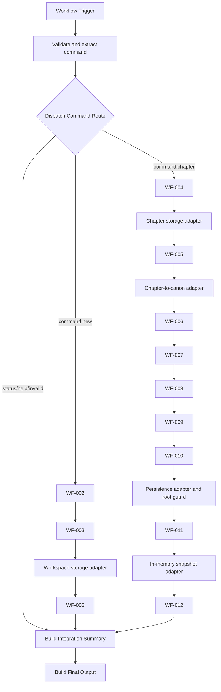

# WF-000 — Novel Studio Integration Orchestrator v1

## Purpose

WF-000 is the sole integration workflow that sequences the existing Novel Studio business workflows. It receives a normalized command after WF-001, selects one route, invokes published sub-workflows synchronously, validates every returned stage contract, stops a branch on blocking output, preserves identifiers and diagnostics, and returns one `telegram.reply` result. It contains adapters only; it does not duplicate story, storage, or knowledge business logic.

## Architecture

The workflow uses one Execute Workflow Trigger, a command Switch, official Execute Sub-workflow nodes, contract/adaptation Code nodes, validation IF gates, and one shared output path. Both WF-005 calls are separate because workspace persistence and chapter persistence require different contracts. Every Execute Sub-workflow node waits for completion, passes the current item, has no credentials, and continues error output into its validation gate so binding/runtime errors become integration failures.

Each called stage is followed by a Code validator and an IF gate. A false gate connects directly to the shared summary; later expected stages are journaled as `skipped`.

## Supported command routes

- `command.new` — novel creation pipeline.
- `command.chapter` — chapter, storage, knowledge, persistence, and integrity pipeline.
- `command.status` — deterministic status response; no sub-workflow call.
- `command.help` — deterministic help response; no sub-workflow call.
- `command.invalid` — invalid-command result; no sub-workflow call.

### Actual WF-001 contract differences

The repository WF-001 output stores normalized command data in `context.command`, `context.argument_text`, and `context.command_args`; it does not emit the example's top-level `command` object. WF-000 supports the repository shape first and accepts the example shape as a null-safe fallback. Current WF-001 routes `/new`, `/status`, and `/help`; it does not currently emit `command.chapter`. WF-000 supports `command.chapter` for a normalized WF-001-compatible caller, but does not add an alias or change WF-001.

## Novel creation route

`command.new` calls:

1. WF-002 Novel Manager;
2. WF-003 Workspace Manager;
3. the workspace adapter;
4. WF-005 Storage Manager.

WF-004 is not called on this path. A successful result uses `integration.novel.completed`.

## Chapter processing route

`command.chapter` calls:

1. WF-004 Chapter Manager;
2. the chapter storage adapter and WF-005;
3. the chapter-to-canon adapter and WF-006;
4. WF-007, WF-008, WF-009, and WF-010 in sequence;
5. the guarded WF-011 adapter and WF-011;
6. the in-memory snapshot adapter and WF-012.

A successful or review-required result uses `integration.chapter.completed`. WF-012 `review_required` is recorded without treating it as a runtime failure.

## Sub-workflow dependency table

| Stage | Expected workflow name | Actual expected output route | Required evidence |
|---|---|---|---|
| WF-002 | WF-002 - Novel Manager v2 | `novel.metadata.created` | `novel.novel_uuid` |
| WF-003 | WF-003 - Workspace Manager v2 | `workspace.persistence.requested` | workspace and novel UUIDs |
| WF-004 | WF-004 - Chapter Manager v2 | `chapter.persistence.created` | chapter, novel, workspace UUIDs |
| WF-005 | WF-005 - Storage Manager v2 | `storage.completed` | completed storage and root folder ID |
| WF-006 | WF-006 - Canon Knowledge Manager v2 | `canon.created` | canon, novel, workspace UUIDs |
| WF-007 | WF-007 - Character Knowledge Manager v2 | `characters.created` | context IDs and characters array |
| WF-008 | WF-008 - World Knowledge Manager v2 | `world.created` | context IDs and worlds array |
| WF-009 | WF-009 - Timeline Knowledge Manager v2 | `timeline.created` | context IDs and timeline array |
| WF-010 | WF-010 - Story Bible Manager v2 | `story_bible.created` | Story Bible, novel, workspace UUIDs |
| WF-011 | WF-011 - Knowledge Persistence Manager v2 | `knowledge.persistence.completed` | completed persistence and IDs |
| WF-012 | WF-012 - Knowledge Integrity Manager v2 | `knowledge.integrity.completed` | integrity report UUID |

The table intentionally follows repository contracts. In particular, WF-002 and WF-003 use `novel.metadata.created` and `workspace.persistence.requested`, rather than the abbreviated routes in the task's illustrative list.

## Contract adapters

Adapters are deliberately small and deterministic:

1. **Command extraction** maps either repository `context.*` command fields or the optional example `command` object into preserved orchestration context.
2. **WF-005 novel storage** adds `persistence_type: "workspace"`, the available base/existing parent ID, and preserved context to the untouched WF-003 contract.
3. **WF-005 chapter storage** adds `persistence_type: "chapter"`, the existing workspace root, and available folder map to the untouched WF-004 contract.
4. **WF-006 canon input** restores the valid in-memory WF-004 chapter contract after WF-005 and attaches only the already-supplied chapter content. WF-005's `storage.completed` route is not sent incompatibly to WF-006.
5. **WF-011 persistence input** adds the root ID and folder map to the untouched WF-010 output. If no root ID was established, it records a blocked WF-011 entry and never executes WF-011.
6. **WF-012 integrity input** adds a normalized snapshot derived only from the WF-010 Story Bible sections held in memory. It performs no Drive read-back.

No adapter generates prose, story facts, knowledge records, storage results, or fake success.

## Context preservation

The orchestration state preserves Telegram IDs and the optional command timestamp; novel UUID/slug/title; workspace UUID/name; existing/root folder IDs and URL; chapter UUID/number/title; Story Bible UUID; persistence ID; and integrity report UUID. Each field is extracted with type checks and defaults. The final contract exposes only this allowlisted context, not intermediate workflow internals or OAuth data.

## Stop conditions and error handling

Every called stage validates output existence, `status`, boolean `is_valid`, `validation_errors`, the exact repository route, and stage identifiers. `error`, `blocked`, false validity, malformed output, missing required identifiers, or a missing workflow binding closes the active branch. The journal captures expected/actual routes and concise errors, and the summary marks all remaining expected stages skipped. Persistence cannot run after a failed knowledge stage. A missing root blocks before WF-011. No pipeline with a required failed stage can report completed.

Validators use only current incoming stage data plus the guaranteed preceding state node on the already-selected branch; they never reference a node on an optional branch that may not have executed.

## Execution journal

Each executed stage produces an entry with stage ID, published workflow name, supported status (`success`, `error`, `blocked`, `skipped`, or `review_required`), validity, actual and expected route, start/completion timestamps, and a concise error. It contains no credentials, secrets, full payload copies, or OAuth details. The summary derives expected, executed, succeeded, failed, skipped, and review-required counts from this journal.

## Final output contracts

All outputs use schema `1.0`, workflow version `1.0`, and target `telegram.reply`.

- Novel success: `integration.novel.completed`, ready and valid, `novel_creation`/`completed`.
- Chapter success: `integration.chapter.completed`, ready and valid, `chapter_processing`/`completed`.
- Chapter integrity review: `integration.chapter.completed`, ready and valid, `review_required`.
- Help: `integration.help`, ready and valid, `help`.
- Status: `integration.status`, ready and valid, `status`.
- Invalid command: `integration.invalid`, error and invalid, `invalid_command`.
- Blocked/runtime failure: `integration.failed`, error and invalid, `blocked` or `error`, with `result: null`.

Integration IDs use the `INTG-` prefix and the repository's `Math.random` fallback approach; no crypto API is used. WF-000 does not send Telegram messages.

## Null-safety behavior

Code nodes validate parent shapes before nested access, coerce identifiers without assuming their presence, and accept missing sub-workflow/error output. Execute nodes use regular error output so validators can record failures. Optional routes are isolated by the Switch and IF gates. Invalid intake is normalized to `command.invalid` and always reaches the shared final output. There are no optional-branch node lookups and no direct references to unexecuted sub-workflows.

## Import guide

1. Import WF-001 through WF-012 into n8n 2.29 or later.
2. Publish every sub-workflow used by the desired routes.
3. Import `WF-000_Integration_Orchestrator_v1.0.json`.
4. Open every Execute Sub-workflow node and bind it as described below.
5. Save and publish WF-000.
6. Configure the caller after WF-001 to execute WF-000 and pass the current item.

No credential binding is required by WF-000 itself.

## Sub-workflow binding instructions

The export intentionally leaves every database workflow selector value empty to avoid environment-specific IDs. Each selector displays its expected workflow name as the cached label. Manually select:

- `Call WF-002 Novel Manager` → WF-002 - Novel Manager v2
- `Call WF-003 Workspace Manager` → WF-003 - Workspace Manager v2
- both WF-005 call nodes → WF-005 - Storage Manager v2
- each remaining call node → the matching WF-004 or WF-006 through WF-012 workflow shown in its label

Keep **Wait for Sub-workflow Completion** enabled, use database selection, pass the current item to each passthrough sub-workflow trigger, and do not attach credentials. Reselect bindings after import if n8n does not preserve selectors.

## Publish instructions

Publish WF-002 through WF-012 before WF-000. After all selectors resolve without warnings, publish WF-000. WF-001 remains the Telegram entry; invoke WF-000 only after WF-001 has produced its normalized command output. No Telegram Trigger or reply sender belongs in WF-000.

## End-to-end testing

Test in a non-production workspace with explicit sub-workflow bindings:

1. `command.new` executes only WF-002 → WF-003 → workspace WF-005.
2. `command.chapter` with valid IDs/root executes all nine chapter stages.
3. Invalid WF-002 output stops WF-003 and storage.
4. Failed chapter WF-005 skips all knowledge stages and reports WF-005.
5. Missing root ID blocks before WF-011.
6. WF-012 review output completes with `review_required`.
7. Help and status execute no sub-workflows.
8. Invalid command returns an error without sub-workflow calls.
9. Clear one selector and verify the binding error is journaled without an unhandled Code-node crash.
10. Confirm import shows one trigger, twelve configurable call nodes (WF-005 appears twice), no credentials, and only core n8n nodes.

## Known limitations

- Requires all referenced sub-workflows to be imported.
- Requires referenced sub-workflows to be published.
- Execute Sub-workflow bindings may need manual reselection after import.
- No Telegram reply sending in v1.
- No retry policy in v1.
- No persistent orchestration state.
- No resumable execution.
- No parallel processing.
- Contract adapters depend on current WF-001 through WF-012 contracts.

## Version history

- **1.0** — Initial centralized Novel Studio integration orchestrator with isolated command routes, synchronous stage gates, adapters, journal, and final integration contract.
