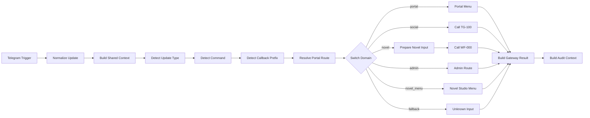

# TG-000 - Portal Gateway v1

## Purpose

`TG-000 - Portal Gateway v1` is the Telegram ingress and routing-only gateway for 御策羅盤. It targets n8n v2.29+, normalizes `message` and `callback_query` updates, produces the shared Telegram context, and dispatches only to the selected subsystem boundary.

The workflow contains no Social Center or Novel Studio business logic. It does not call OpenAI, Google Drive, Google Sheets, databases, or external APIs. The workflow is exported inactive and contains no credential binding.

Source of truth: [`docs/architecture/Yuce-Luopan-Portal-Architecture-v1.0.md`](../../../docs/architecture/Yuce-Luopan-Portal-Architecture-v1.0.md).

## Architecture

```text
Telegram Bot
  ↓ (the only active Telegram webhook after migration)
TG-000 Portal Gateway
  ├─ portal → menu, planned-module response, or fallback
  ├─ social → TG-100 Social Center adapter (manual binding)
  ├─ novel → WF-000 Integration Orchestrator (manual binding)
  └─ admin → deterministic v1 route contract
```

`TG-000` owns Channel intake and routing. `TG-100` owns the Social Center adapter boundary. `WF-000` remains the Novel Studio orchestrator. `TG-000` never directly reproduces or invokes `IC-TG-001` logic outside the `TG-100` boundary.

## Workflow diagram



The export contains 17 functional nodes and six Sticky Notes. The `Build Audit Context` output is informational only; v1 does not persist audit records.

## Telegram Trigger ownership

After migration, this workflow must be the **only** active Telegram Trigger owner for the Bot. Publishing both `TG-000` and `IC-TG-001` with the same Bot is invalid because Telegram supports one active webhook destination and the workflows would overwrite each other's webhook.

The export is intentionally `active: false`. Credential selection, manual testing, old-owner unpublishing, and new-owner publishing are separate operator actions.

## Supported commands

Commands are recognized only at the beginning of `message.text`, after optional leading whitespace.

| Domain | Commands | Behavior |
|---|---|---|
| Portal | `/start`, `/menu`, `/back` | Return `gateway.menu`; no subsystem call. |
| Novel Studio | `/NOVEL` (`/novel`) | Return the Novel Studio inline-keyboard menu; do not call `WF-000`. |
| Novel Studio | `/new`, `/chapter` | Prepare the Novel Studio v2 input contract and call `WF-000`. |
| Novel Studio | `/storybible` | Return `supported_not_implemented`; do not invent success or call `WF-000`. |
| Social Center | `/publish`, `/results`, `/socialstatus` | Call the manually bound `TG-100` adapter. |
| Administration | `/system`, `/health` | Return a deterministic `admin.route` result without internal system data. |

Telegram suffix syntax is supported, including `/new@BotUsername`. The parser separates the suffix but does not contain a Bot username secret. Operators should note that v1 cannot verify the suffix against a configured username because the workflow deliberately contains no credential-derived configuration; Telegram normally delivers commands intended for the receiving Bot.

## Supported callbacks

| Prefix | Examples | Destination |
|---|---|---|
| `portal:` | `portal:home`, `portal:back`, `portal:planned:metaphysics` | Portal response |
| `social:` | `social:publish`, `social:results`, `social:status` | `TG-100` |
| `novel:` | `novel:create` (adapted to the existing `new` command) | `WF-000` |
| `novel:` | `novel:select`, `novel:chapter_create`, `novel:chapter_write`, `novel:status`, `novel:home`, `novel:list`, `novel:storybible` | Recognized; supported-not-implemented response |
| `admin:` | `admin:system`, `admin:health`, `admin:home` | Deterministic admin route |

Unknown prefixes and empty `callback_data` use the Portal fallback. Prefixes prevent action collisions across subsystems.

## Shared context contract

Every accepted update is normalized to this null-safe contract before routing:

```json
{
  "schema_version": "1.0",
  "gateway_version": "1.0",
  "source": "telegram",
  "telegram": {
    "update_id": 0,
    "chat_id": 0,
    "user_id": 0,
    "message_id": 0,
    "message_text": "",
    "callback_query_id": "",
    "callback_data": "",
    "language_code": ""
  },
  "user": {
    "portal_user_id": "",
    "display_name": "",
    "locale": "zh-TW"
  },
  "route": {
    "domain": "",
    "action": "",
    "target_workflow": ""
  },
  "received_at": ""
}
```

Numeric Telegram IDs remain numbers when Telegram supplies numbers. Missing IDs use `0`; missing strings use `""`; `received_at` is generated with `new Date().toISOString()`. The original Telegram update is also passed to the subsystem input as `original_update`.

## Portal menu

The Telegram-compatible definition contains `text` and `inline_keyboard`:

- 📖 小說工作室 → `novel:home` (active route boundary; home view is not implemented in v1)
- 📢 社群中心 → `social:home` (active)
- ⚙️ 系統設定 → `admin:home` (active deterministic route)
- 🔮 AI 命理（規劃中） → `portal:planned:metaphysics`
- 🌌 修仙世界（規劃中） → `portal:planned:cultivation`
- 👥 宗門（規劃中） → `portal:planned:sect`

The menu is a response definition. TG-000 does not add a Telegram Send Message node; final Telegram reply formatting may be supplied by the caller or subsystem.


## Novel Studio menu

`/NOVEL` is command-detected case-insensitively as `/novel` and returns exactly one Telegram-compatible menu definition without invoking `WF-000` or any workflow:

- Title/body text: `📚 Novel Studio

請選擇功能：`
- ➕ 新增小說 → `novel:create`
- 📖 選擇小說 → `novel:select`
- 📝 建立章節 → `novel:chapter_create`
- ✍️ 寫作章節 → `novel:chapter_write`
- 📊 小說狀態 → `novel:status`
- ⬅ 返回社群中心 → `social:home`

All six payloads follow the canonical `<domain>:<action>` gateway contract. `novel:create` resolves to `domain = novel`, `action = create`, `target_workflow = WF-000`, and `route_branch = novel`; the adapter sends the existing `new` command to WF-000. The other Novel Studio actions are recognized but remain unimplemented, and `social:home` follows the existing Social Center boundary.

## Social Center integration

`Call TG-100 Social Center` is an official **Execute Sub-workflow** node with an intentionally empty workflow selection. After import, bind it to the TG-100 adapter. TG-100 may then adapt to `IC-TG-001 Router v3.1.4 FINAL（三按鈕版）` while preserving its original three-button behavior.

TG-000 passes the original Telegram update, normalized context, detection data, and resolved Social route. If the binding is absent or execution fails, the error-continuation path is normalized as `gateway.failed`; TG-000 does not reproduce Social Center publishing logic.

## Novel Studio integration

`Call WF-000 Integration Orchestrator` must be manually bound to `WF-000 - Novel Studio Integration Orchestrator v1`. Only `new` and `chapter` dispatch in v1:

```json
{
  "schema_version": "1.0",
  "workflow_version": "2.0",
  "route": "command.new",
  "target": "WF-000",
  "status": "ready",
  "is_valid": true,
  "validation_errors": [],
  "command": {
    "name": "new",
    "arguments": [],
    "raw_text": ""
  },
  "context": {
    "telegram_update_id": 0,
    "telegram_chat_id": 0,
    "telegram_user_id": 0,
    "received_at": ""
  }
}
```

For `/chapter`, the existing command route remains available. `/NOVEL` returns the Novel Studio menu without calling WF-000. For `novel:create`, TG-000 preserves the canonical gateway action as `create` while adapting the WF-000 input to its existing `new` compatibility command and top-level `telegram_chat_id`. WF-000 remains the orchestration owner, reads/saves sessions through WF-001A, and TG-000 converts its `telegram_message` result into the required Telegram response contract: `{"type":"telegram_message","text":"📚 建立新小說\n\n請輸入小說名稱："}`. The remaining unimplemented Novel Studio callbacks return a truthful supported-not-implemented result.

## Command parsing

The parser keeps quoted text as one argument and uses the field name `arguments` only at `command.arguments`.

```text
/new "被退婚後，我覺醒神級宗門系統" 修仙
→ command.name: new
→ command.arguments: ["被退婚後，我覺醒神級宗門系統", "修仙"]

/chapter 1
→ command.name: chapter
→ command.arguments: ["1"]
```

Both double-quoted and single-quoted arguments are accepted. Unquoted tokens are separated on whitespace. No parser branch performs Novel Studio validation or creation.

## Planned module behavior

`portal:planned:metaphysics`, `portal:planned:cultivation`, and `portal:planned:sect` return:

```json
{
  "status": "ready",
  "is_valid": true,
  "message": "此功能尚在規劃中。"
}
```

No subsystem executes for these callbacks.

## Admin behavior

`/system`, `/health`, `admin:system`, and `admin:health` produce a deterministic `admin.route` branch response. It contains no credential, environment variable, token, internal URL, or stack trace. Admin allowlist enforcement is deferred and the result explicitly exposes `allowlist_enforced: false`; this route must not be treated as authorization for privileged work.

## Fallback behavior

Unknown commands, plain text, empty messages, invalid callbacks, and unsupported update types return a ready Portal fallback plus the main menu. They never call TG-100 or WF-000. An unsupported Novel Studio v1 action returns `supported_not_implemented` instead of false success.

## Final output contracts

### Menu

`gateway.menu` has `status: ready`, `is_valid: true`, `gateway.domain: portal`, `gateway.dispatched: false`, the menu definition, Telegram context, and user context.

### Successful subsystem dispatch

`gateway.dispatched` has `status: ready`, `is_valid: true`, the selected `novel` or `social` domain, action, target workflow, timestamps, `dispatched: true`, downstream `result`, Telegram context, and user context. The adapter contract should preserve `gateway_context`/dispatch metadata in its result so TG-000 can form the complete envelope.

### Failure

A missing binding or failed Execute Sub-workflow is returned as `gateway.failed`, `status: error`, `is_valid: false`, `dispatched: false`, `failed_stage: subworkflow_dispatch`, a safe validation error, and `result: null`. Stack traces and internal endpoints are not intentionally copied to the public envelope.

Portal planned, admin, fallback, and supported-not-implemented responses use `gateway.ready` because they are valid non-menu, non-dispatch outcomes.

## Null safety

Every Code node:

- obtains input with `$input.first()?.json ?? {}`;
- validates optional nested objects before reading fields;
- uses safe number/string defaults;
- does not throw an intentional or unhandled error;
- routes unsupported update types to fallback;
- consumes its actual incoming branch data and does not reference optional unexecuted nodes;
- retains the original update until a subsystem boundary;
- never uses `crypto.randomUUID()`.

Execute Sub-workflow nodes use `continueRegularOutput` so binding/execution errors can reach the common failure-envelope builder rather than terminating the gateway without a normalized outcome.

## Import guide

1. In n8n v2.29+, choose **Import from File**.
2. Import `TG-000_Portal_Gateway_v1.0.json`.
3. Confirm the workflow is inactive and contains exactly one Telegram Trigger.
4. Open both Execute Sub-workflow nodes and perform the manual bindings below.
5. Select the Telegram credential on the Trigger; do not paste a Bot Token into any node field.
6. Save and test with manual executions before production migration.

## Manual sub-workflow binding

1. Open **Call TG-100 Social Center** and select the installed TG-100 adapter. Do not select `IC-TG-001` directly in TG-000.
2. Open **Call WF-000 Integration Orchestrator** and select `WF-000 - Novel Studio Integration Orchestrator v1`.
3. Keep **Wait for Sub-Workflow Completion** enabled.
4. Confirm each target has a compatible Execute Workflow Trigger/input contract.
5. A blank or incompatible binding must be treated as `gateway.failed`, not as successful dispatch.

## Credential setup

The export has no `credentials` property and no Bot Token. In the Telegram Trigger, select an n8n-managed Telegram credential manually. The HTTP Request response node reads the complete Telegram `sendMessage` endpoint from the secure runtime configuration `TELEGRAM_SEND_MESSAGE_URL`; that value contains sensitive Bot configuration and must be configured only in the n8n runtime, never pasted into or exported with the workflow. Do not export or commit populated credentials or the resolved URL. The two Execute Sub-workflow nodes need workflow selection, not Telegram credentials.

## Publish/unpublish migration order

Perform these steps in order:

1. Import TG-000.
2. Bind the TG-100 adapter and WF-000 sub-workflows.
3. Select the n8n-managed Telegram credential.
4. Test TG-000 in manual mode.
5. **Unpublish the IC-TG-001 Telegram Trigger owner.**
6. Publish TG-000.
7. Verify that only TG-000 receives updates.
8. Run the Social Center regression tests.
9. Test Novel Studio `/new` end to end.
10. Keep the rollback procedure ready throughout the change window.

Never publish both Telegram Trigger workflows with the same Bot at the same time.

## End-to-end testing

| # | Input | Expected |
|---|---|---|
| 1 | `/start` | `gateway.menu`; menu returned; no subsystem called. |
| 2 | `/new "被退婚後，我覺醒神級宗門系統" 修仙` | Novel route; WF-000 called; two arguments preserved. |
| 3 | `/chapter 1` | Novel route; WF-000 called with `command.arguments: ["1"]`. |
| 4 | `/publish` | Social route; TG-100 called. |
| 5 | `social:publish` callback | Social route; TG-100 called. |
| 6 | `novel:create` callback | `domain=novel`, `action=create`, `target_workflow=WF-000`, `route_branch=novel`; WF-000 receives its compatible `new` command and returns the novel-title prompt. |
| 7 | `novel:select` callback | Canonical Novel callback recognized; supported-not-implemented; no recent-novel behavior. |
| 8 | `novel:chapter_create` callback | Canonical Novel callback recognized; supported-not-implemented. |
| 9 | `novel:chapter_write` callback | Canonical Novel callback recognized; supported-not-implemented. |
| 10 | `novel:status` callback | Canonical Novel callback recognized; supported-not-implemented. |
| 11 | `social:home` callback | Social route; TG-100 boundary called. |
| 12 | `hello` | Portal fallback menu; no subsystem called. |
| 13 | Missing `message.text` | No crash; valid callback routes or fallback. |
| 14 | Unsupported update type | No crash; fallback output. |
| 15 | Both old and new Trigger published | Invalid configuration; fail the migration check. |
| 16 | Import into n8n v2.29+ | Core nodes load; credentials and sub-workflows remain manually selectable; no embedded secret/expression-security error. |

Also test `/novel`, `/storybible`, planned callbacks, empty callback data, unknown callback prefix, and a deliberately unbound sub-workflow. Inspect the Telegram webhook after publishing and confirm a single owner.

## Rollback procedure

1. Stop new routing and account for in-flight subsystem executions.
2. Unpublish/disable TG-000 first.
3. Restore `IC-TG-001` as the active Telegram Trigger owner.
4. Verify the Bot has only that active webhook owner.
5. Re-test the original Social Center three-button behavior: 今日發布、發布結果、系統狀態.
6. Keep Novel Studio independently testable with mock or sub-workflow input; no Novel Studio workflow or data migration is required for rollback.

Do not enable the old owner before disabling TG-000.

## Known limitations

- The TG-100 adapter may require manual workflow binding and may not yet be present at import time.
- Admin allowlist is not implemented in v1; admin routes perform no privileged action.
- No persistent session is implemented.
- No `portal_user_id` resolution service is implemented; the value remains empty.
- No rate limiting is implemented.
- No audit persistence is implemented; only an in-memory output context is built.
- AI Metaphysics, Cultivation World, and Sect System are placeholders.
- Telegram reply formatting may still depend on subsystem output.
- The command suffix is parsed but cannot be checked against a configured Bot username in this secret-free v1 export.
- Complete successful-dispatch envelopes depend on the bound adapter preserving the shared gateway metadata in its response; binding or contract failures produce the safe failure envelope.

## Version history

| Version | Date | Changes |
|---|---|---|
| 1.0 | 2026-08-07 | Canonicalized all Novel Studio callbacks, added the `novel:create` WF-000 adapter/response path, and removed Bot-token URL construction from the export. |
| 1.0 | 2026-08-02 | Initial routing-only gateway for Portal, Social Center, Novel Studio, Administration, planned modules, and fallback. |
