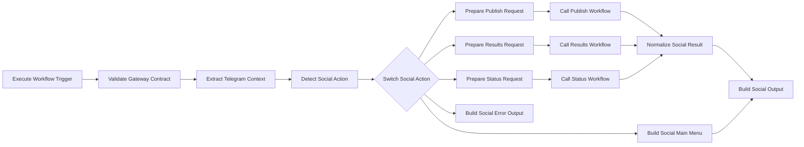

# TG-100 - Social Center Adapter v1

## Purpose

`TG-100` is the routing and contract-adaptation boundary between `TG-000 Portal Gateway` and the independently owned Social Center workflows. It accepts normalized Telegram context, exposes the existing three-button experience, prepares action request contracts, and normalizes downstream results. It targets n8n v2.29+ and contains no publishing business logic.

## Architecture

```text
TG-000 Portal Gateway
  ↓ canonical/wrapped Gateway context
TG-100 Social Center Adapter
  ├─ menu → Telegram-compatible three-button definition
  ├─ publish → callable Publish workflow (manual binding)
  ├─ results → callable Results workflow (manual binding)
  └─ status → callable Status workflow (manual binding)
```

### Workflow diagram



The export contains 15 functional nodes and four Sticky Notes.

## Relationship with TG-000

TG-000 remains the only Telegram Trigger/webhook owner. It routes the entire incoming item—including `gateway_context`, `original_update`, detection data, and route—to TG-100. TG-100 accepts this current wrapped shape and also accepts the canonical context directly. TG-100 returns a response definition to its caller; it does not send Telegram messages itself.

## Relationship with IC-TG-001

`IC-TG-001 Router v3.1.4 FINAL（三按鈕版）` is existing production Social Center infrastructure and is not modified or duplicated here. Repository inspection found no independent callable Publish, Results, or Status workflow export, so all three Execute Sub-workflow selectors are intentionally unbound.

Do not bind TG-100 directly to IC-TG-001 unless that deployed workflow has a valid Execute Workflow Trigger and explicitly supports this adapter contract. A Telegram Trigger is not a callable sub-workflow interface. Prefer the actual independently callable workflows behind the three existing buttons.

## Why TG-100 has no Telegram Trigger

TG-100 has exactly one Execute Workflow Trigger and has no Telegram, Webhook, Schedule, or Manual Trigger. Adding another Telegram Trigger would compete with TG-000 for the single Bot webhook and violate the approved architecture.

## Supported actions

Detection priority is strictly:

1. `route.action`;
2. `telegram.callback_data`;
3. a command at the beginning of `telegram.message_text`;
4. fallback to `menu`.

| Canonical action | Accepted route action values |
|---|---|
| `menu` | `social.home`, `social.menu`, `home`, `menu` |
| `publish` | `social.publish`, `publish` |
| `results` | `social.results`, `results` |
| `status` | `social.status`, `socialstatus`, `status` |

### Supported commands

- `/publish`
- `/results`
- `/socialstatus`

The same commands accept the Telegram suffix form, such as `/publish@BotUsername`. Matching occurs only at the beginning of the text.

### Supported callbacks

- `social:home`
- `social:publish`
- `social:results`
- `social:status`

Unknown Social Center input returns the menu and calls no downstream workflow.

## Social main menu

TG-100 returns this Telegram-compatible response definition:

```json
{
  "type": "telegram_menu",
  "text": "📢 社群中心",
  "inline_keyboard": [
    [{ "text": "🚀 今日發布", "callback_data": "social:publish" }],
    [
      { "text": "📊 發布結果", "callback_data": "social:results" },
      { "text": "⚙️ 系統狀態", "callback_data": "social:status" }
    ],
    [{ "text": "🏠 返回主選單", "callback_data": "portal:home" }]
  ]
}
```

No Telegram Send Message node is included.

## Adapter input contract

TG-100 accepts canonical Gateway context v1.0 with `schema_version`, `gateway_version`, `source`, `telegram`, `user`, `route`, and `received_at`. It also unwraps that contract when supplied as TG-000's `gateway_context`. Numeric Telegram IDs remain numbers; absent fields use safe defaults. `route.domain`, when present, must be `social`.

```json
{
  "schema_version": "1.0",
  "gateway_version": "1.0",
  "source": "telegram",
  "telegram": {},
  "user": {},
  "route": { "domain": "social", "action": "", "target_workflow": "TG-100" },
  "received_at": ""
}
```

## Action request contracts

All three requests contain `schema_version: 1.0`, `adapter_version: 1.0`, `status: ready`, `is_valid: true`, `validation_errors: []`, normalized `telegram` and `user`, `original_update`, and:

```json
{
  "context": {
    "source_gateway": "TG-000",
    "source_adapter": "TG-100",
    "requested_at": "ISO-8601"
  }
}
```

### Publish request

`route` is `social.publish.requested`. The adapter does not invent publication text, schedule, or platform selection.

### Results request

`route` is `social.results.requested`. Results lookup remains owned by the bound downstream workflow.

### Status request

`route` is `social.status.requested`. Status computation remains owned by the bound downstream workflow.

Each request includes `adapter_context`; a compatible downstream workflow must preserve it in its output so the common result normalizer can retain action, target, Telegram chat ID, and user context without referencing an unexecuted branch node.

## Sub-workflow binding instructions

After import, open and bind these official Execute Sub-workflow nodes:

1. **Call Existing Publish Workflow** → the callable workflow behind 🚀 今日發布.
2. **Call Existing Results Workflow** → the callable workflow behind 📊 發布結果.
3. **Call Existing Status Workflow** → the callable workflow behind ⚙️ 系統狀態.

Each selected workflow must have an Execute Workflow Trigger, accept the documented request, and return `adapter_context` plus its safe result fields. Keep **Wait for Sub-Workflow Completion** enabled. Do not select a Telegram-trigger-only router. Empty selectors are deliberate placeholders, not successful bindings.

Before any TG-000 publication, confirm all three selectors can be bound to the currently deployed independent workflows. If they cannot, stop migration and add callable boundaries to those workflows in a separate reviewed change; do not copy their business logic into TG-100.

## Final output contracts

### Menu

- `route: social.menu.created`
- `status: ready`, `is_valid: true`
- `social.action: menu`, `dispatched: false`
- `response.type: telegram_menu`, with the three buttons and Portal navigation
- normalized `telegram` and `user`

### Completed action

- `route: social.action.completed`
- `status: ready`, `is_valid: true`
- `social.action`: `publish`, `results`, or `status`
- `dispatched: true`, manually bound target name, ISO `completed_at`
- safe normalized downstream `result`, Telegram context, and user context

### Failed action

- `route: social.action.failed`
- `status: error`, `is_valid: false`
- `dispatched: false`, `failed_stage`
- safe `validation_errors`, `result: null`, Telegram context, and user context

The result normalizer retains only route, status, validity, validation errors, response/menu data, and response text. It does not intentionally expose arbitrary credential, token, environment, URL, or stack-trace fields.

## Null-safety behavior

Every Code node reads `$input.all()` and selects `items[0]?.json ?? {}`. Nested route, Telegram, user, response, and error values are type-checked before access. Missing route or Telegram fields cannot crash execution; unknown input becomes the menu. Invalid Gateway contracts reach `Build Social Error Output`. Missing binding, absent output, missing preserved `adapter_context`, or downstream error becomes `social.action.failed` without an intentional throw. No Code node references `$('Node Name').all()` or any optional branch.

## Import guide

1. Import `TG-100_Social_Center_Adapter_v1.0.json` into n8n v2.29+.
2. Confirm it is inactive, has exactly one Execute Workflow Trigger, and has no Telegram Trigger.
3. Inspect the three Execute Sub-workflow selectors.
4. Bind each selector only after confirming its deployed target has an Execute Workflow Trigger and compatible contract.
5. Save and invoke TG-100 from a test caller or TG-000 manual execution.
6. Do not publish TG-000 until all three bindings and regression tests pass.

## Publish instructions

TG-100 itself has no webhook to register. Saving/activating it only makes its callable workflow available under the instance's sub-workflow policy. Configure n8n workflow access so TG-000 may call it. Keep TG-000 unpublished while validating all three downstream bindings. Production webhook migration remains governed by the TG-000 runbook.

## Testing

| Test | Input | Expected |
|---|---|---|
| Menu | `route.action = social.menu` | Three-button menu; no downstream call. |
| Publish callback | `callback_data = social:publish` | Publish branch only. |
| Results command | `message_text = /results` | Results branch only. |
| Status command | `message_text = /socialstatus` | Status branch only. |
| Unknown | unrecognized action/text | Menu; no downstream call. |
| Missing Telegram | no `telegram` object | No crash; menu or safe contract error. |
| Unbound Publish | empty Publish selector | `social.action.failed`; no unhandled exception. |
| Downstream error | error/invalid downstream output with preserved metadata | Error preserved as safe TG-100 failure. |
| Import | n8n v2.29+ | One Execute Workflow Trigger, three visible selectors, no Telegram Trigger/credential/security error. |

Also test suffix commands, callback priority over command only when route action is absent, original update propagation, Telegram chat ID preservation, and that only the selected Execute Sub-workflow runs.

## Migration plan

1. Import TG-100 while TG-000 remains unpublished.
2. Identify the deployed callable workflows behind the three production buttons.
3. Verify each has an Execute Workflow Trigger and compatible input/output behavior.
4. Bind Publish, Results, and Status selectors independently.
5. Run contract, null, failure, and three-button regression tests.
6. Bind TG-000's TG-100 selector to this adapter.
7. Only after all evidence passes, follow TG-000's single-webhook publish/unpublish migration order.

## Rollback plan

1. Stop Portal migration; do not publish TG-000 if any TG-100 binding is unavailable.
2. If already migrated, unpublish TG-000 before restoring the old webhook owner.
3. Restore `IC-TG-001` as the sole active Telegram Trigger owner.
4. Verify 今日發布、發布結果、系統狀態 in the original three-button interface.
5. Disable or unbind TG-100 without moving data; it has no persistent state.

## Known limitations

- Existing downstream workflow bindings require manual selection; no callable exports were found in this repository.
- IC-TG-001 cannot be called unless it supports Execute Workflow Trigger and this normalized contract.
- Telegram reply sending may remain in downstream workflows.
- No persistent Social Center session exists.
- No rate limiting exists.
- No admin authorization is implemented by TG-100.
- No audit persistence exists.
- Successful common output normalization requires the bound workflow to preserve `adapter_context`.

## Version history

| Version | Date | Change |
|---|---|---|
| 1.0 | 2026-08-02 | Initial three-action Social Center adapter with unbound callable-workflow selectors. |
